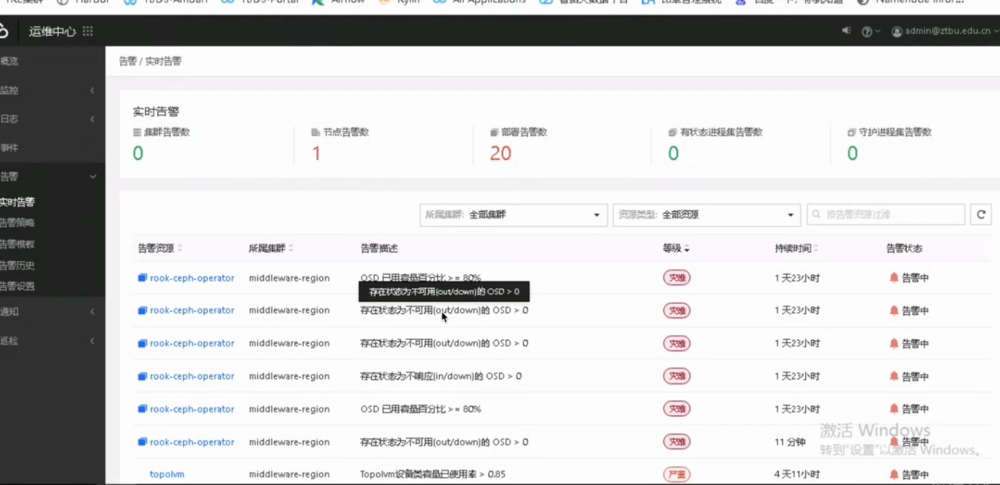
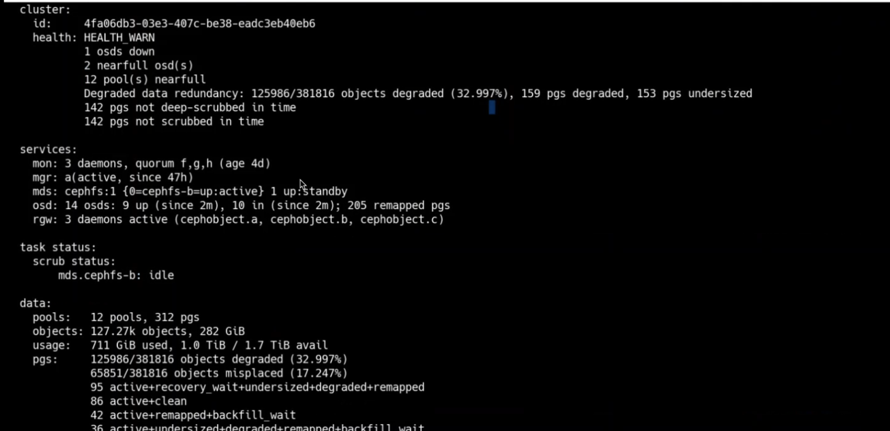
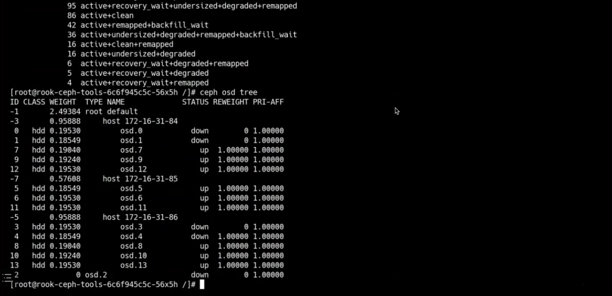

---
kind:
  - Troubleshooting
products:
  - Alauda Container Platform
  - Alauda DevOps
  - Alauda AI
  - Alauda Application Services
  - Alauda Service Mesh
  - Alauda Developer Portal
ProductsVersion:
  - 4.1.0,4.2.x
---
<!-- A type of document that involves encountering a fault, diagnosing it, performing root cause analysis, and providing solutions. -->

# ceph集群osd down告警和存储池满告警

osd down告警 存储池使用率85%和83%

## Cause

## Resolution
- 执行ceph osd out osd.<id>
- ceph osd crush remove osd.<id>
- ceph auth del osd.<id>
- ceph osd rm osd.<id>
- 节点扩容200G磁盘
- 调整恢复参数: ceph tell osd.* injectargs --osd_max_backfills=128
- 持续监控状态: watch 'ceph -s'

## [workaround]

## [Related Information]
**Screenshots**

- Environment: 通用
- osd
- 存储池
- ceph osd out
- ceph auth del
- osd_max_backfills
- Component: Ceph
- Page ID: 127428017
- Original Title: ceph集群osd down告警和存储池满告警
