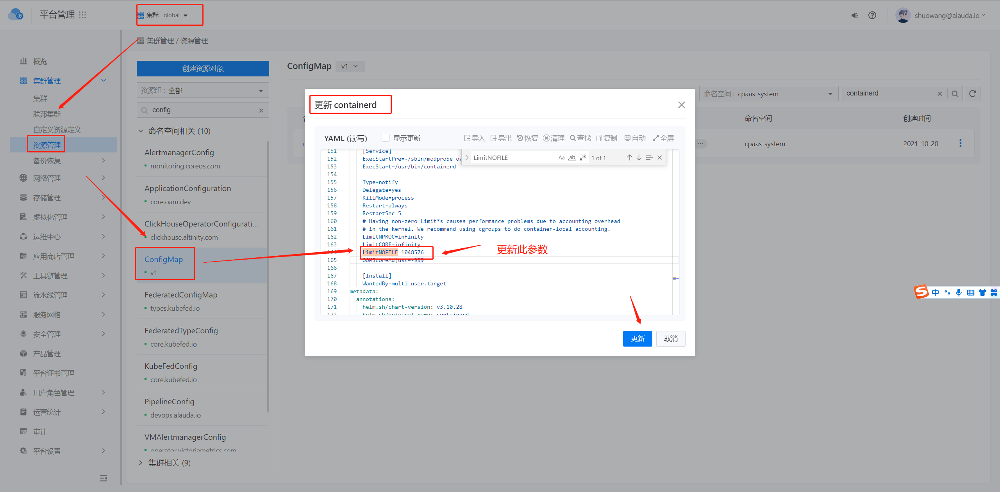

---
kind:
  - Troubleshooting
products:
  - Alauda Container Platform
  - Alauda DevOps
  - Alauda AI
  - Alauda Application Services
  - Alauda Service Mesh
  - Alauda Developer Portal
ProductsVersion:
  - 4.1.0,4.2.x
---
<!-- A type of document that involves encountering a fault, diagnosing it, performing root cause analysis, and providing solutions. -->

# 3.10

ceph部署失败 容器内ulimit -n返回1073741816 python处理超时

## Cause
- 麒麟OS默认limit值过高
- containerd的systemd配置LimitNOFILE=infinity
- ceph容器继承过高文件描述符限制

## Resolution
- 编辑/etc/systemd/system/containerd.service设置LimitNOFILE=1048576
- 重启物理节点
- 修改global集群containerd的configmap配置
- 新平台部署时通过kubectl修改cpaas-system命名空间的containerd configmap

## [workaround]

## [Related Information]
**Screenshots**

- Environment: 3.10版本containerd+x86架构+麒麟OS集群
- containerd.service
- LimitNOFILE
- /etc/systemd/system/containerd.service
- cpaas-system/containerd configmap
- Component: Ceph
- Page ID: 130551054
- Original Title: 3.10-containerd+x86操作系统集群下部署ceph不成功
