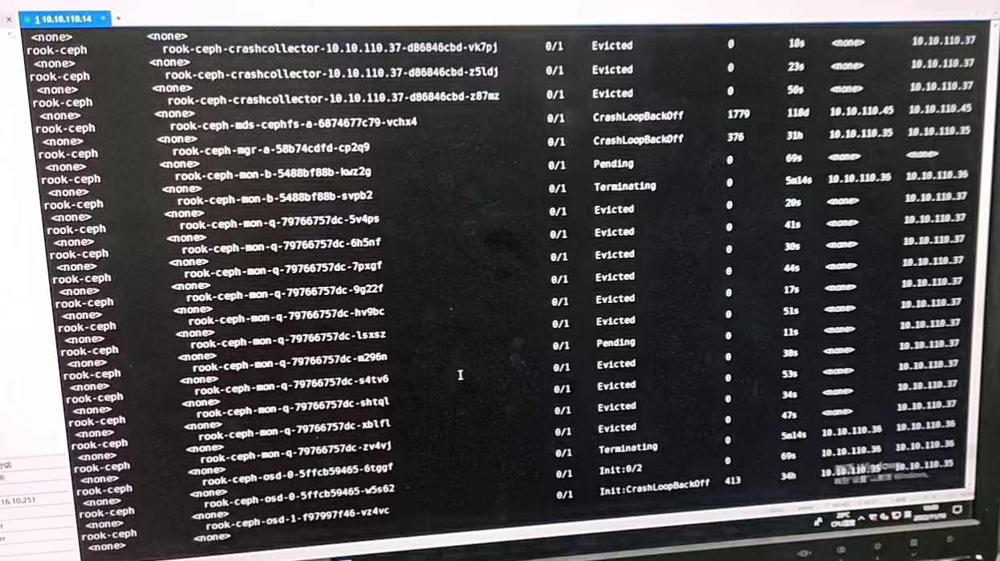
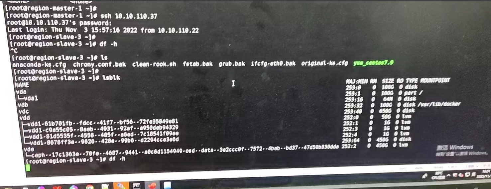
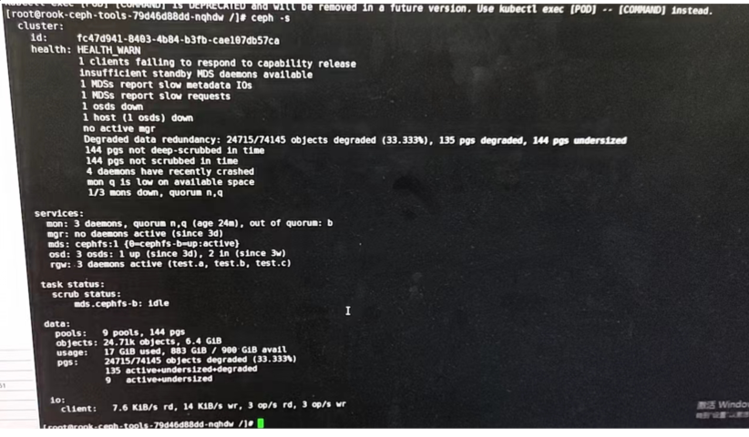
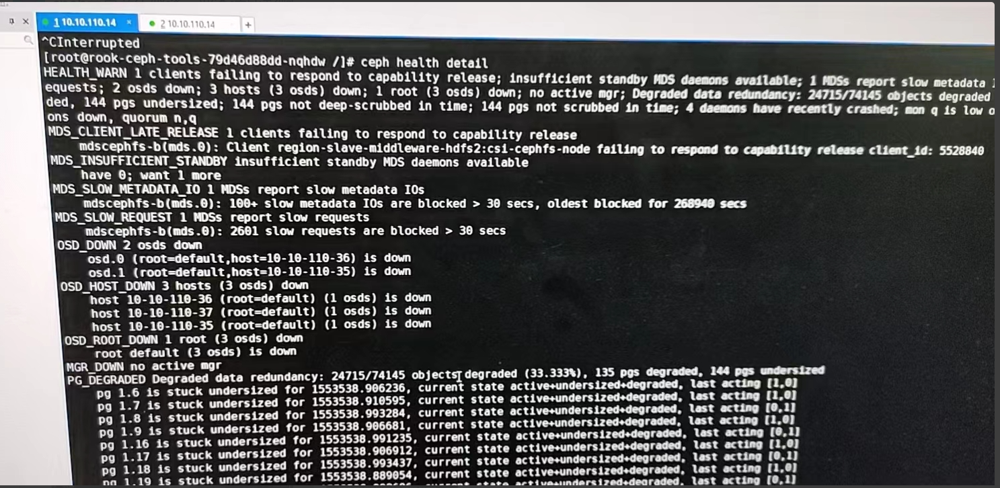
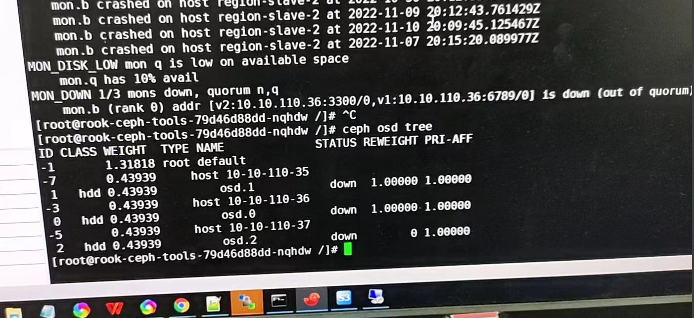
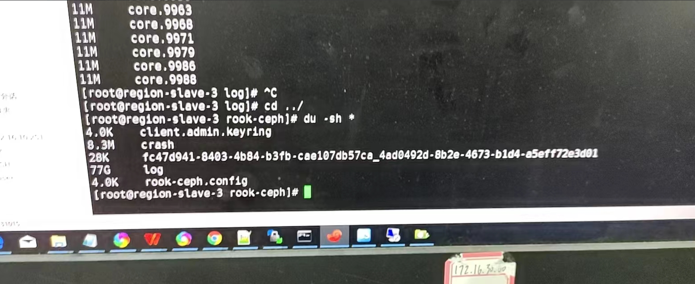
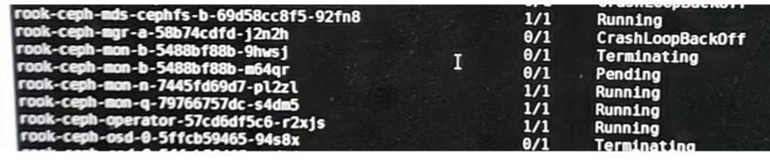
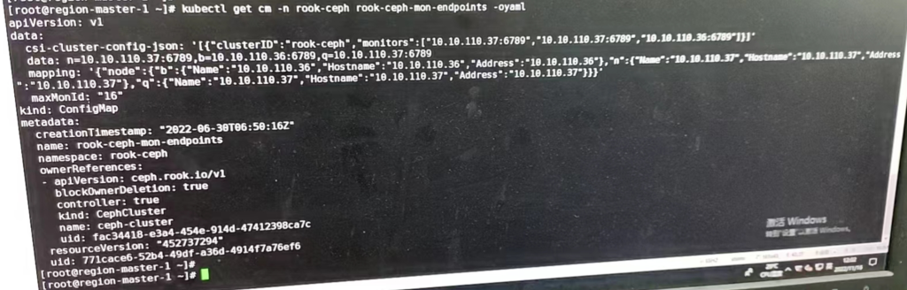
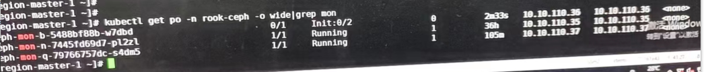
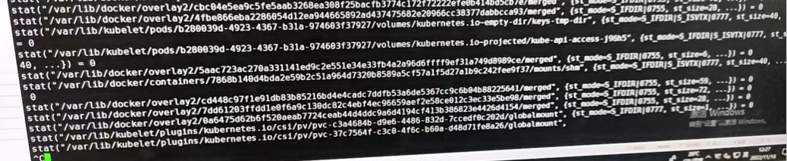

---
kind:
  - Troubleshooting
products:
  - Alauda Container Platform
  - Alauda DevOps
  - Alauda AI
  - Alauda Application Services
  - Alauda Service Mesh
  - Alauda Developer Portal
ProductsVersion:
  - 4.1.0,4.2.x
---
<!-- A type of document that involves encountering a fault, diagnosing it, performing root cause analysis, and providing solutions. -->

# 3.8.1

ceph容器被驱逐 osd down掉，存储空间不足 df -h命令卡死

## Cause
- /var/lib/rook/rook-ceph/log日志目录占满磁盘导致/盘使用率超过85%
- 磁盘占满触发驱逐导致mon配置混乱
- ceph挂掉后pvc卸载卡住磁盘操作，osd无法启动形成死循环

## Resolution
- 删除/var/lib/rook/rook-ceph/log释放空间
- 修改cephcluster配置关闭崩溃收集器：
kubectl edit cephcluster -n rook-ceph ceph-cluster
...
crashCollector:
  disable: true
...

## [workaround]
- 强制umount卡住的pv恢复mon和osd启动

## [Related Information]
**Screenshots**

- Environment: 3.8.1
- /var/lib/rook/rook-ceph/log
- cephcluster.spec.crashCollector.disable
- rook-ceph命名空间
- rook-ceph-mon-endpoints配置映射
- ceph osd df
- ceph health detail
- Component: Ceph
- Page ID: 130561170
- Original Title: 3.8.1-ceph集群异常，容器全部被驱逐
