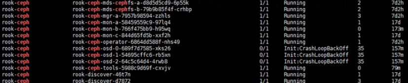
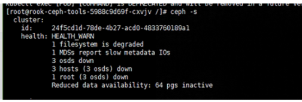
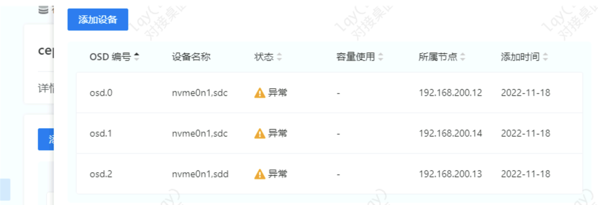
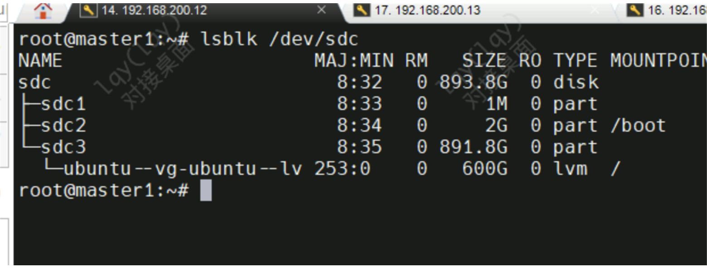
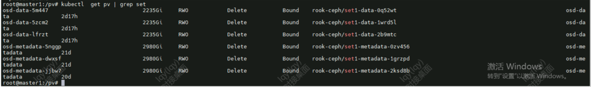
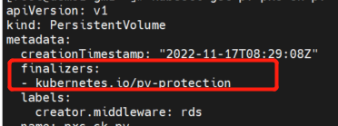
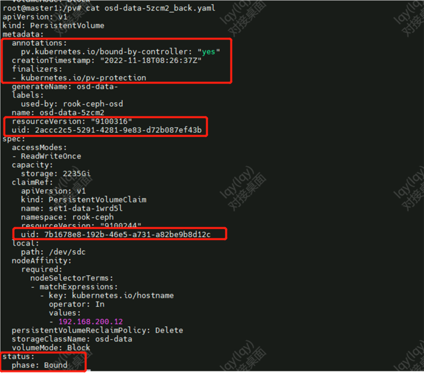
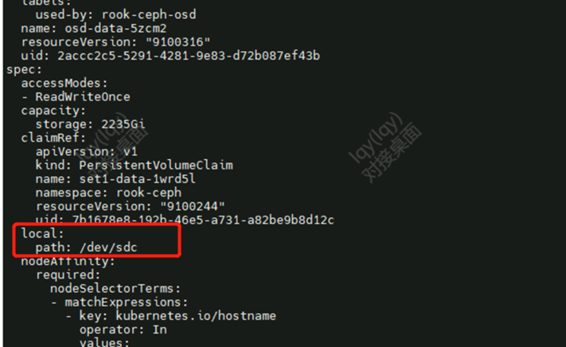

---
kind:
  - Troubleshooting
products:
  - Alauda Container Platform
  - Alauda DevOps
  - Alauda AI
  - Alauda Application Services
  - Alauda Service Mesh
  - Alauda Developer Portal
ProductsVersion:
  - 4.1.0,4.2.x
---
<!-- A type of document that involves encountering a fault, diagnosing it, performing root cause analysis, and providing solutions. -->

# ceph故障

ceph状态显示故障 三节点osd全部down掉 磁盘盘符从sdc变为sda

## Cause
- 物理机重启导致磁盘盘符发生改变

## Resolution
- 调整rook-ceph-operator和rook-ceph-osd副本数为0
- 备份并删除原有PV
- 修改PV配置中的设备路径(将/dev/sdc改为/dev/sda)
- 重建PV并修复PVC绑定状态
- 恢复operator和osd副本数

## [workaround]

## [Related Information]
**Screenshots**

- Environment: 使用混合类型存储设备的Ceph内置存储部署方案
- rook-ceph-osd
- rook-ceph-operator
- PV/PVC
- /dev/sda
- /dev/sdc
- kubernetes.io/pv-protection
- Component: Ceph
- Page ID: 133076278
- Original Title: ceph故障-磁盘盘符改变导致ceph异常
