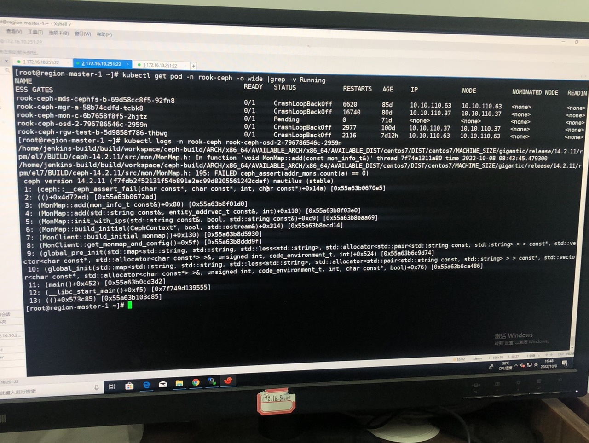
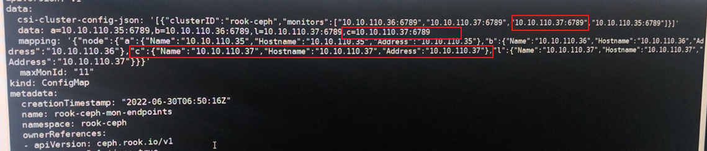

---
kind:
  - Troubleshooting
products:
  - Alauda Container Platform
  - Alauda DevOps
  - Alauda AI
  - Alauda Application Services
  - Alauda Service Mesh
  - Alauda Developer Portal
ProductsVersion:
  - 4.1.0,4.2.x
---
<!-- A type of document that involves encountering a fault, diagnosing it, performing root cause analysis, and providing solutions. -->

# 3.8.1

ceph相关pod处于Pending状态 事件显示CPU资源不足 rook-ceph-mon3节点存在4个ceph pod

## Cause
- 节点资源不足导致pod无法调度
- Ceph Monitor配置中存在多余节点信息

## Resolution
- 修改rook-ceph-mon对应的ConfigMap文件
- 删除配置中多余的节点信息
- 清理多余的ceph monitor deployment

## [workaround]

## [Related Information]
**Screenshots**
1、查看ceph组件中pending的查看事件是cpu不足，其他crash查看日志报错类似

- Environment: 3.8.1
- rook-ceph-mon3
- ConfigMap
- Deployment
- CPU资源分配
- Component: Ceph
- Page ID: 133081607
- Original Title: 3.8.1-容器平台-分布式存储ceph相关pod异常
