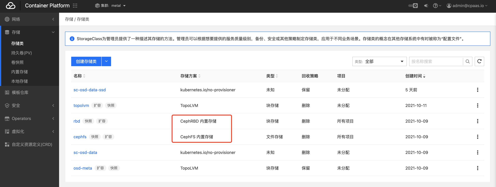
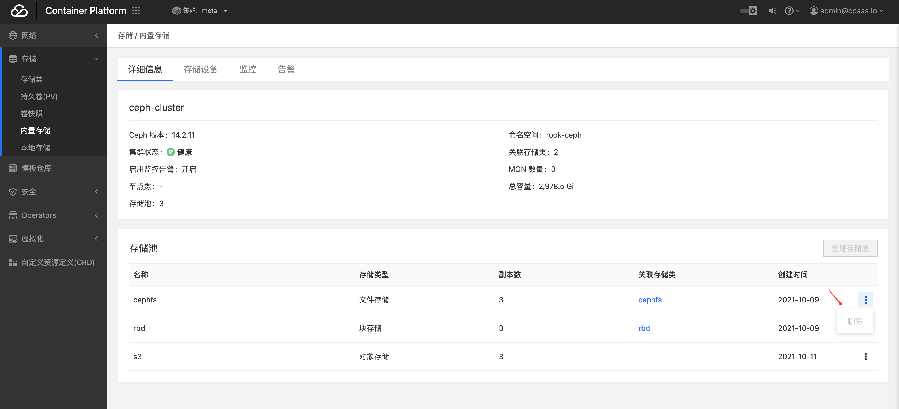
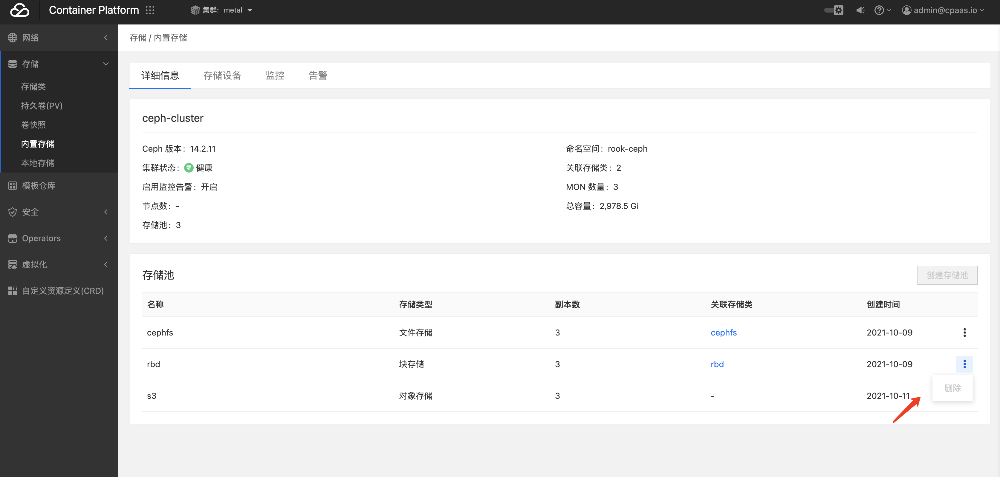
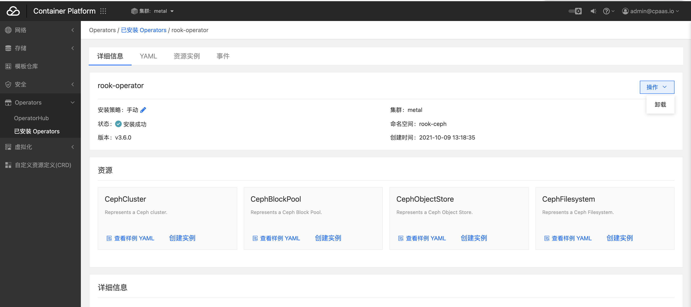

---
kind:
  - Troubleshooting
products:
  - Alauda Container Platform
  - Alauda DevOps
  - Alauda AI
  - Alauda Application Services
  - Alauda Service Mesh
  - Alauda Developer Portal
ProductsVersion:
  - 4.1.0,4.2.x
---
<!-- A type of document that involves encountering a fault, diagnosing it, performing root cause analysis, and providing solutions. -->

# rook

残留PVC/PV资源 未删除存储池 CephCluster存在finalizers

## Cause
- 未正确执行清理步骤导致数据残留

## Resolution
- kubectl delete storageclass rook-ceph-block rook-ceph-filesystem
- kubectl -n rook-ceph patch cephcluster ceph-cluster --type merge -p '{"spec":{"cleanupPolicy":{"confirmation":"yes-really-destroy-data"}}}'
- kubectl -n rook-ceph delete cephcluster ceph-cluster
- kubectl -n rook-ceph delete deployment rook-ceph-operator
- sh clean-rook.sh /dev/[设备名称]
- kubectl delete csidriver rook-ceph.cephfs.csi.ceph.com rook-ceph.rbd.csi.ceph.com
- rm -rf /var/lib/rook/*

## [workaround]

## [Related Information]
**Screenshots**

- Environment: Kubernetes 3.10/3.12
- StorageClass
- CephCluster
- rook-ceph-block
- rook-ceph-filesystem
- rook-ceph-operator
- CSIDriver
- /var/lib/rook
- clean-rook.sh
- /dev/[设备名称]
- Component: Ceph
- Page ID: 133082706
- Original Title: rook-ceph 卸载 重装
