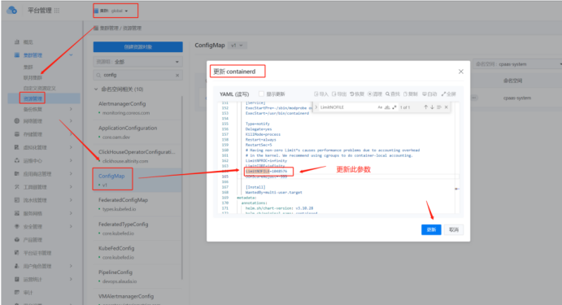

---
kind:
  - Troubleshooting
products:
  - Alauda Container Platform
  - Alauda DevOps
  - Alauda AI
  - Alauda Application Services
  - Alauda Service Mesh
  - Alauda Developer Portal
ProductsVersion:
  - 4.1.0,4.2.x
---
<!-- A type of document that involves encountering a fault, diagnosing it, performing root cause analysis, and providing solutions. -->

# 3.10 + containerd集群

创建ceph集群卡住 ceph部署失败 容器内ulimit -n值为1073741816

## Cause
- 麒麟OS默认limit值过大
- containerd的systemd配置LimitNOFILE=infinity
- python标准库处理速度过慢导致超时

## Resolution
- 修改/etc/systemd/system/containerd.service的LimitNOFILE=1048576
- 重启物理节点
- global集群修改containerd的configmap配置
- 新平台部署时通过kubectl更新containerd configmap

## [workaround]

## [Related Information]
**Screenshots**
****

- Environment: KylinOS + 3.10版本平台 + containerd集群
- /etc/systemd/system/containerd.service
- cpaas-system/containerd configmap
- LimitNOFILE参数
- Component: Ceph
- Page ID: 133082755
- Original Title: 3.10 + containerd集群---创建ceph卡住
