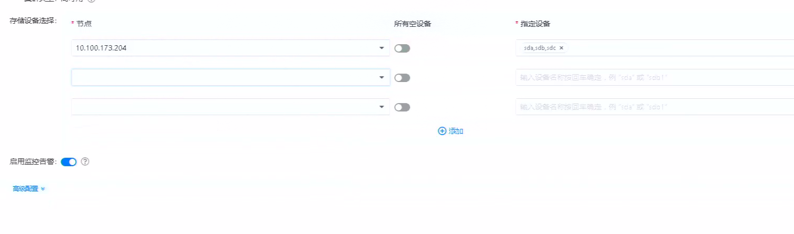

---
kind:
  - Troubleshooting
products:
  - Alauda Container Platform
  - Alauda DevOps
  - Alauda AI
  - Alauda Application Services
  - Alauda Service Mesh
  - Alauda Developer Portal
ProductsVersion:
  - 4.1.0,4.2.x
---
<!-- A type of document that involves encountering a fault, diagnosing it, performing root cause analysis, and providing solutions. -->

# 3.8.2

rgw组件pod健康检查失败不断重启 退出码137 日志无显著报错仅有debug信息

## Cause
- 部署时存储设备选择配置添加了多个磁盘

## Resolution
- 每个节点添加单个存储设备后重新部署

## [workaround]

## [Related Information]
**Screenshots**

- Environment: 3.8.2
- ceph rgw
- 存储设备配置
- Component: Ceph
- Page ID: 133091949
- Original Title: 3.8.2-容器平台-ceph rgw组件pod健康检查失败不断重启
