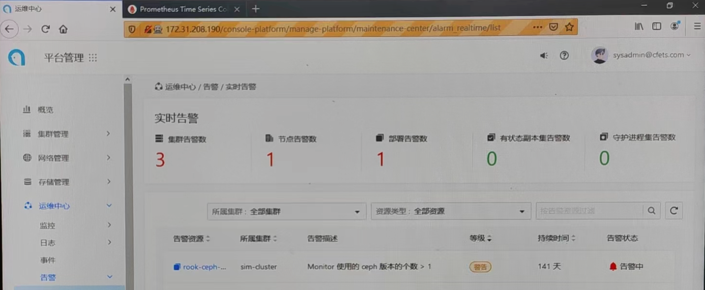
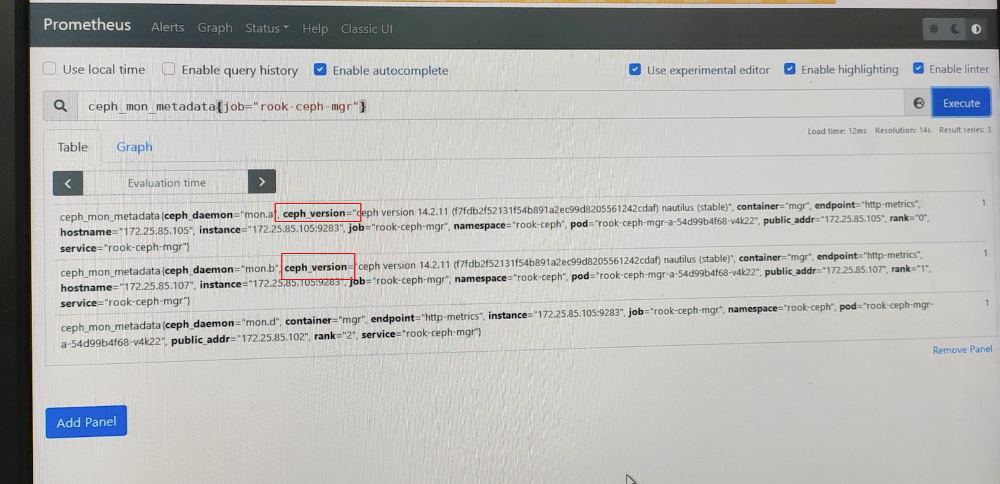
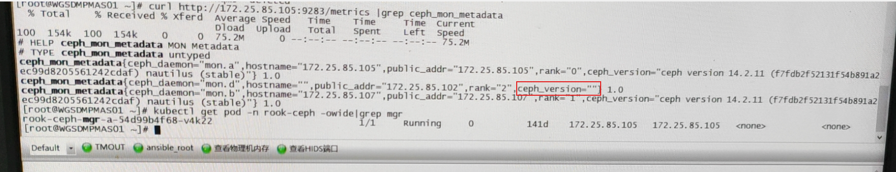

---
kind:
  - Troubleshooting
products:
  - Alauda Container Platform
  - Alauda DevOps
  - Alauda AI
  - Alauda Application Services
  - Alauda Service Mesh
  - Alauda Developer Portal
ProductsVersion:
  - 4.1.0,4.2.x
---
<!-- A type of document that involves encountering a fault, diagnosing it, performing root cause analysis, and providing solutions. -->

# rook

rook-ceph告警monitor存在的ceph版本个数大于1 mon.d实例缺失ceph_version字段 mon-d容器存在频繁重启记录

## Cause
- mon-d容器异常导致mgr无法获取监控数据
- 缺失ceph_version字段的monitor被统计为独立版本

## Resolution
- 重启mon-d和mgr容器恢复监控数据采集

## [workaround]

## [Related Information]
**Screenshots**

- Environment: 3.8.1
- rook-ceph-mgr
- ceph_mon_metadata
- mon.d
- mgr
- Component: Ceph
- Page ID: 136521453
- Original Title: rook-ceph告警monitor的存在的ceph版本大于1
