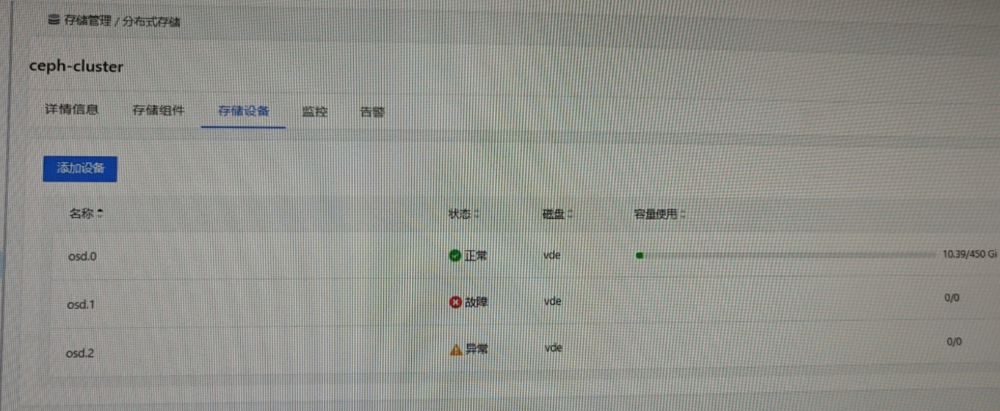
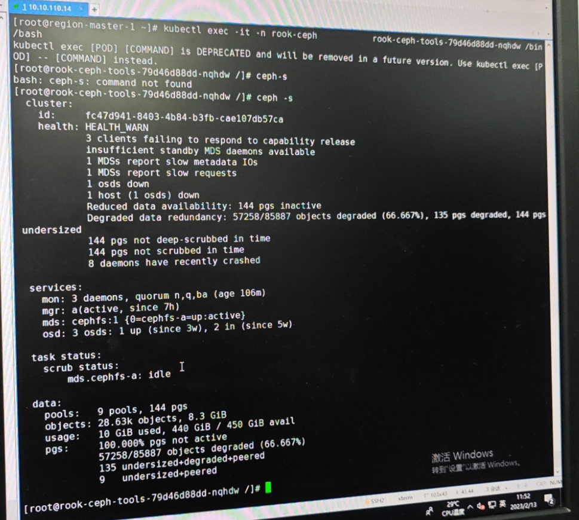
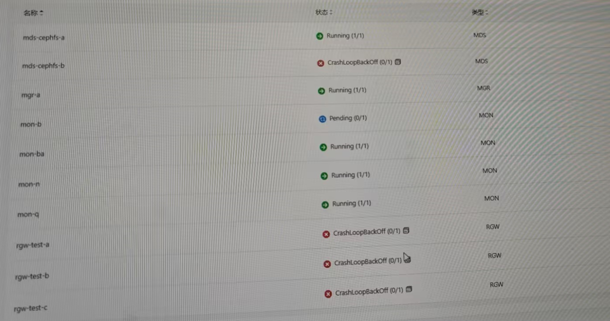
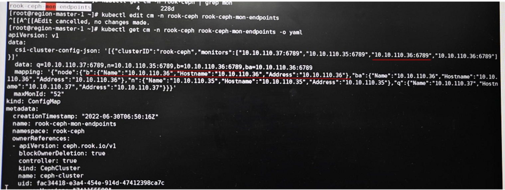
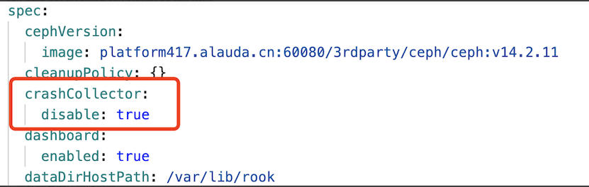

---
kind:
  - Troubleshooting
products:
  - Alauda Container Platform
  - Alauda DevOps
  - Alauda AI
  - Alauda Application Services
  - Alauda Service Mesh
  - Alauda Developer Portal
ProductsVersion:
  - 4.1.0,4.2.x
---
<!-- A type of document that involves encountering a fault, diagnosing it, performing root cause analysis, and providing solutions. -->

# 3.8.1

osd的pod处于init:crashloopbackoff状态 mon的pod有四个其中一个pending /var/lib/rook/rook-ceph/log目录占用62G磁盘空间

## Cause
- ceph mon异常导致osd启动异常
- coredump日志导致磁盘空间占满

## Resolution
- 删除多余的mon deployment并重启rook-ceph-operator
- 在cephcluster配置中添加字段防止coredump刷日志

## [workaround]

## [Related Information]
**Screenshots**

- Environment: 3.8
- /var/lib/rook/rook-ceph/log
- rook-ceph-tools
- rook-ceph-operator
- cephcluster
- Component: Ceph
- Page ID: 136536094
- Original Title: 3.8.1-ceph故障-osd的pod处于init:crashloopbackoff状态
