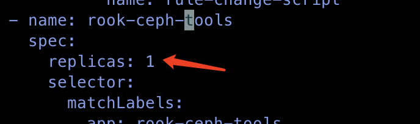

---
kind:
  - Troubleshooting
products:
  - Alauda Container Platform
  - Alauda DevOps
  - Alauda AI
  - Alauda Application Services
  - Alauda Service Mesh
  - Alauda Developer Portal
ProductsVersion:
  - 4.1.0,4.2.x
---
<!-- A type of document that involves encountering a fault, diagnosing it, performing root cause analysis, and providing solutions. -->

# ceph

ceph -s 显示告警: all OSDs are running pacific or later but require_osd_release < pacific

## Cause
- require_osd_release 配置未更新至与当前运行的OSD版本(pacific或更高)一致

## Resolution
- kubectl edit csv -n rook-ceph rook-ceph.v3.8.4 修改tools工具的replicas为1
- 在rook-ceph-tools的pod中执行: ceph osd require-osd-release pacific

## [workaround]

## [Related Information]
**Screenshots**

- Environment: 3.10.2
- rook-ceph.v3.8.4 CSV
- rook-ceph-tools pod
- ceph osd require-osd-release
- Component: Ceph
- Page ID: 136538471
- Original Title: ceph-osd-require-osd-release告警
