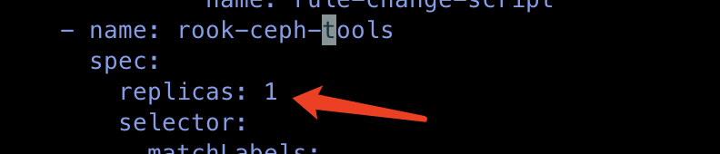

---
kind:
  - Troubleshooting
products:
  - Alauda Container Platform
  - Alauda DevOps
  - Alauda AI
  - Alauda Application Services
  - Alauda Service Mesh
  - Alauda Developer Portal
ProductsVersion:
  - 4.1.0,4.2.x
---
<!-- A type of document that involves encountering a fault, diagnosing it, performing root cause analysis, and providing solutions. -->

# ceph

mon is allowing insecure global_id reclaim

## Cause
- auth_allow_insecure_global_id_reclaim enabled

## Resolution
- kubectl edit csv -n rook-ceph rook-ceph.v3.8.4
- ceph config set mon auth_allow_insecure_global_id_reclaim false

## [workaround]

## [Related Information]
**Screenshots**

- Environment: 3.10.2
- rook-ceph-tools
- ceph-mon
- auth_allow_insecure_global_id_reclaim
- Component: Ceph
- Page ID: 136538474
- Original Title: ceph-mon-mon auth_allow_insecure_global_id_reclaim 告警
