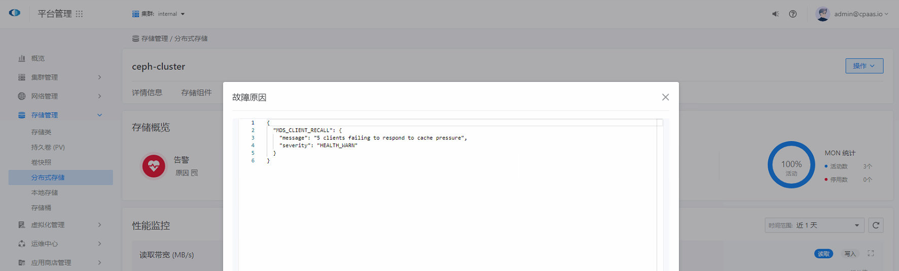

---
kind:
  - Troubleshooting
products:
  - Alauda Container Platform
  - Alauda DevOps
  - Alauda AI
  - Alauda Application Services
  - Alauda Service Mesh
  - Alauda Developer Portal
ProductsVersion:
  - 4.1.0,4.2.x
---
<!-- A type of document that involves encountering a fault, diagnosing it, performing root cause analysis, and providing solutions. -->

# ceph不健康，报错5 clients failing to respond to cache pressure

ceph集群不健康，报错5 clients failing to respond to cache pressure

## Cause
- 客户端日志索引等高请求业务导致rook-ceph-mds缓存压力过高
- 客户端打开过多文件

## Resolution
- 降低客户端写入缓存压力
- 调整mds缓存限制：ceph config set mds mds_cache_memory_limit 40G
- 重启cephfs容器：kubectl delete pod -n rook-ceph cephfs-a-hw23q
- 重启cephfs容器：kubectl delete pod -n rook-ceph cephfs-b-1q3df

## [workaround]

## [Related Information]
**Screenshots**

- Environment: 3.10
- rook-ceph-mds
- cephfs-a
- cephfs-b
- mds_cache_memory_limit
- Component: Ceph
- Page ID: 136540833
- Original Title: ceph不健康，报错5 clients failing to respond to cache pressure
