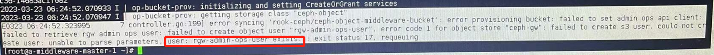

---
kind:
  - Troubleshooting
products:
  - Alauda Container Platform
  - Alauda DevOps
  - Alauda AI
  - Alauda Application Services
  - Alauda Service Mesh
  - Alauda Developer Portal
ProductsVersion:
  - 4.1.0,4.2.x
---
<!-- A type of document that involves encountering a fault, diagnosing it, performing root cause analysis, and providing solutions. -->

# rook

objectbucketclaim pending secret not created rook-ceph-operator log shows 'user: rgw-admin-ops-user exists'

## Cause
- rgw-admin-ops-user already exists due to incomplete environment cleanup from previous Ceph deployment

## Resolution
- radosgw-admin user rm --uid rgw-admin-ops-user
- recreate bucket

## [workaround]

## [Related Information]
**Screenshots**

- Environment: rook-ceph (通用版本)
- rook-ceph-operator
- Ceph RGW
- objectbucketclaim
- radosgw-admin
- Component: Ceph
- Page ID: 140825064
- Original Title: rook-ceph bucket创建失败
