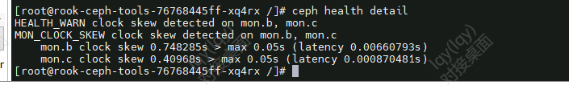

---
kind:
  - Troubleshooting
products:
  - Alauda Container Platform
  - Alauda DevOps
  - Alauda AI
  - Alauda Application Services
  - Alauda Service Mesh
  - Alauda Developer Portal
ProductsVersion:
  - 4.1.0,4.2.x
---
<!-- A type of document that involves encountering a fault, diagnosing it, performing root cause analysis, and providing solutions. -->

# 3.10.1

ceph监控报错'clock skew detected on mon.b, mon.c' ceph -s显示mon节点存在时间偏移

## Cause
- 主机重启导致主机间时间不同步

## Resolution
- 修正集群主机节点间时间同步

## [workaround]

## [Related Information]
**Screenshots**

- Environment: 3.10.1
- ceph mon
- 时间同步
- Component: Ceph
- Page ID: 140825120
- Original Title: 3.10.1-容器平台-主机重启后ceph存储报错“clock skew detected on mon.b, mon.c”
