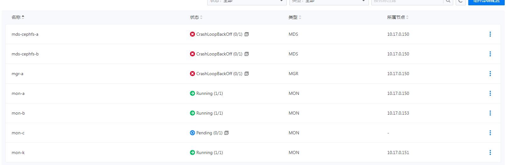
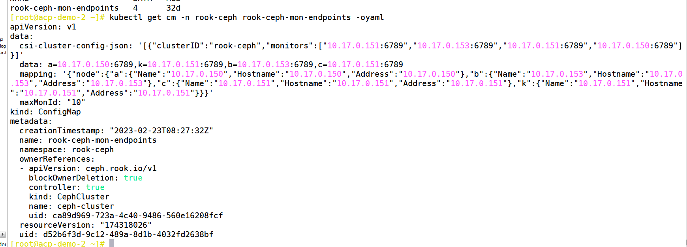

---
kind:
  - Troubleshooting
products:
  - Alauda Container Platform
  - Alauda DevOps
  - Alauda AI
  - Alauda Application Services
  - Alauda Service Mesh
  - Alauda Developer Portal
ProductsVersion:
  - 4.1.0,4.2.x
---
<!-- A type of document that involves encountering a fault, diagnosing it, performing root cause analysis, and providing solutions. -->

# 3.10.2

ceph集群健康状态告警 mon节点df -hT查询夯住 mon组件存在多余pending节点

## Cause
- rook-ceph-mon-endpoints和rook-ceph-csi-config configmap存在重复节点配置

## Resolution
- 修改rook-ceph-mon-endpoints和rook-ceph-csi-config configmap删除多余节点
- 删除对应的mon deployment
- 重启异常ceph组件

## [workaround]

## [Related Information]
**Screenshots**

- Environment: 3.10.2
- rook-ceph-mon-endpoints
- rook-ceph-csi-config
- mon deployment
- Component: Ceph
- Page ID: 140825167
- Original Title: 3.10.2-容器平台-分布式存储ceph的组件故障
