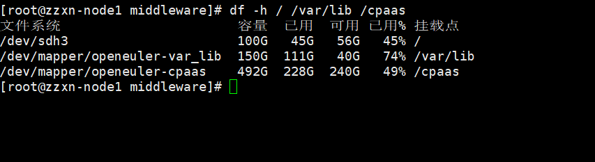

---
kind:
  - Troubleshooting
products:
  - Alauda Container Platform
  - Alauda DevOps
  - Alauda AI
  - Alauda Application Services
  - Alauda Service Mesh
  - Alauda Developer Portal
ProductsVersion:
  - 4.1.0,4.2.x
---
<!-- A type of document that involves encountering a fault, diagnosing it, performing root cause analysis, and providing solutions. -->

# 3.12.1

ceph存储告警mon b is low on available space

## Cause
- /var/lib目录可用空间少于30%

## Resolution
- 清理/var/lib目录的磁盘空间

## [workaround]

## [Related Information]
**Screenshots**

- Environment: 3.8+
- /var/lib
- ceph monitor
- 节点磁盘
- Component: Ceph
- Page ID: 152633781
- Original Title: 3.12.1-容器平台-ceph存储告警mon b is low on available space
