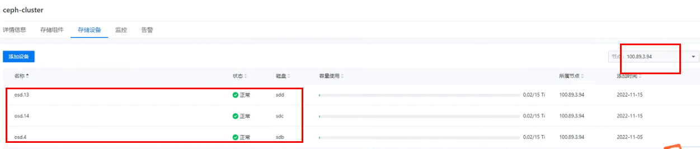
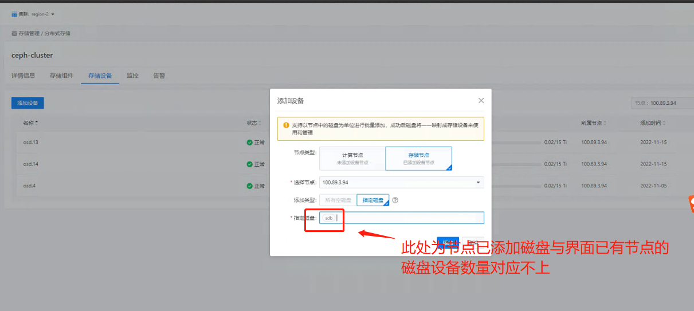
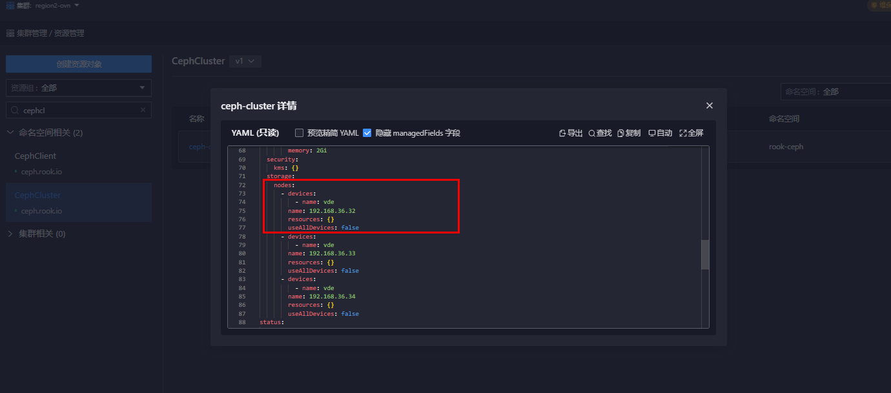

---
kind:
  - Troubleshooting
products:
  - Alauda Container Platform
  - Alauda DevOps
  - Alauda AI
  - Alauda Application Services
  - Alauda Service Mesh
  - Alauda Developer Portal
ProductsVersion:
  - 4.1.0,4.2.x
---
<!-- A type of document that involves encountering a fault, diagnosing it, performing root cause analysis, and providing solutions. -->

# ceph集群对应节点已添加的磁盘设备未在对应界面展示

存储节点上已添加的磁盘在Ceph集群界面未显示 后台OSD分布显示磁盘已正常添加 节点磁盘已存在ceph目录但界面不展示

## Cause
- cephcluster资源未更新磁盘设备信息
- 重复添加设备导致资源信息缺失

## Resolution
- 更新cephcluster资源，添加缺失的磁盘设备信息
- 通过平台批量添加功能一次性添加磁盘

## [workaround]

## [Related Information]
**Screenshots**

- Environment: 3.12.2
- cephcluster资源
- OSD
- sdb
- 资源管理界面
- Component: Ceph
- Page ID: 168322956
- Original Title: ceph集群对应节点已添加的磁盘设备未在对应界面展示
