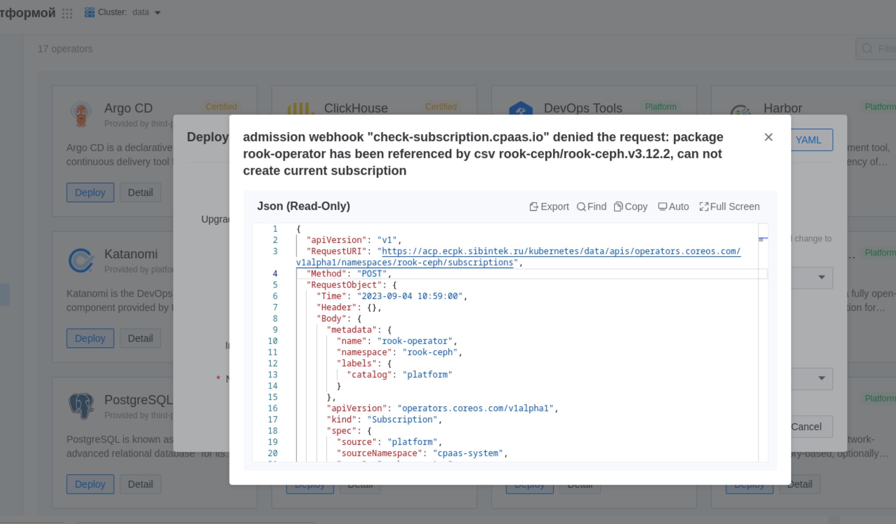
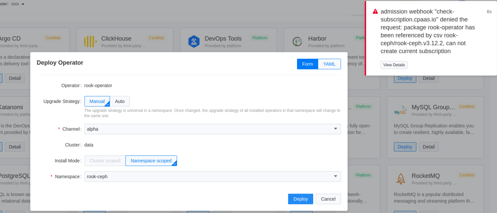
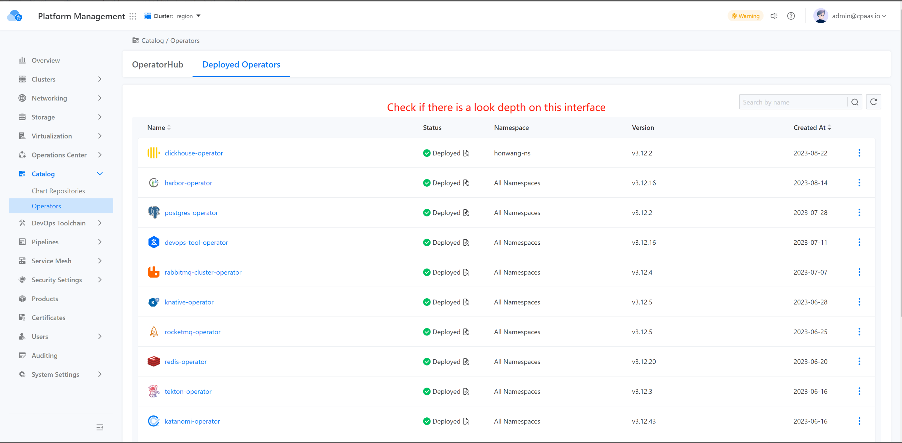
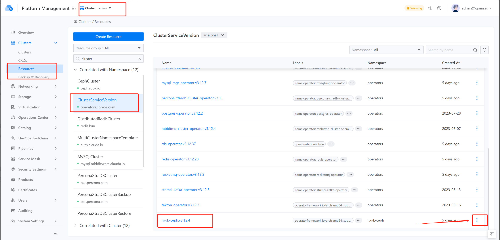

---
kind:
  - Troubleshooting
products:
  - Alauda Container Platform
  - Alauda DevOps
  - Alauda AI
  - Alauda Application Services
  - Alauda Service Mesh
  - Alauda Developer Portal
ProductsVersion:
  - 4.1.0,4.2.x
---
<!-- A type of document that involves encountering a fault, diagnosing it, performing root cause analysis, and providing solutions. -->

# 3.12.1

admission webhook 'check.subscription.cpass.io' denied the request

## Cause
- 残留的rook-ceph CSV资源存在

## Resolution
- 通过资源管理界面删除残留的CSV资源

## [workaround]

## [Related Information]
**Screenshots**

- Environment: 3.12.1
- csv资源
- rook-ceph operator
- check.subscription.cpass.io
- Component: Ceph
- Page ID: 178228190
- Original Title: 3.12.1-部署 Rook-Ceph operator失败
