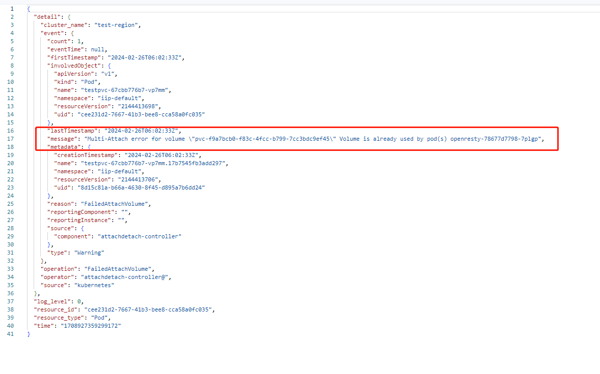
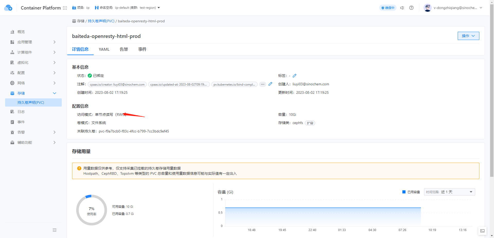

---
kind:
  - Troubleshooting
products:
  - Alauda Container Platform
  - Alauda DevOps
  - Alauda AI
  - Alauda Application Services
  - Alauda Service Mesh
  - Alauda Developer Portal
ProductsVersion:
  - 4.1.0,4.2.x
---
<!-- A type of document that involves encountering a fault, diagnosing it, performing root cause analysis, and providing solutions. -->

# ACP 3.14.1 ceph fs pvc共享挂载超时

FailedMount: Unable to attach or mount volumes: unmounted volumes=[html upload], unattached volumes=[], failed to process volumes=[]: timed out waiting for the condition 第二个挂载应用部署在不同节点时挂载失败

## Cause
- RWO类型的ceph fs pvc不支持多节点读写

## Resolution
- 将pvc访问模式修改为RWX

## [workaround]

## [Related Information]
**Screenshots**

- Environment: ACP 3.12+
- pvc类型
- RWO
- RWX
- ceph fs
- Component: Ceph
- Page ID: 194052392
- Original Title: ACP 3.14.1 ceph fs pvc共享挂载超时
