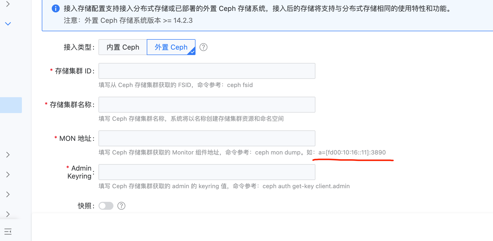

---
kind:
  - Troubleshooting
products:
  - Alauda Container Platform
  - Alauda DevOps
  - Alauda AI
  - Alauda Application Services
  - Alauda Service Mesh
  - Alauda Developer Portal
ProductsVersion:
  - 4.1.0,4.2.x
---
<!-- A type of document that involves encountering a fault, diagnosing it, performing root cause analysis, and providing solutions. -->

# 3.17版本之前接入外部ipv6类型的ceph存储

接入界面显示失败 出现captain故障报错

## Cause
- 3.17版本前UI不支持双栈，仅允许填写IPv4地址

## Resolution
- 修改HelmRequest资源的yaml中mon的value为IPv6地址（格式示例: NFDW3-HGX86TSTACK-TX502-XJKMON01=[fc00:605:200:500:3552::95]:6789）
- 重启captain-controller-manager

## [workaround]
- 在MON地址栏暂时填写IPv4地址完成初始接入流程

## [Related Information]
**Screenshots**

- Environment: 平台版本低于3.17且使用外部IPv6类型Ceph存储
- helmrequest资源
- captain-controller-manager
- ceph mon dump
- ceph -s
- Component: Ceph
- Page ID: 234983058
- Original Title: 3.17版本之前接入外部ipv6类型的ceph存储
