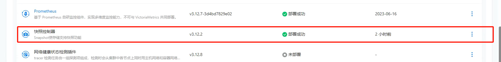
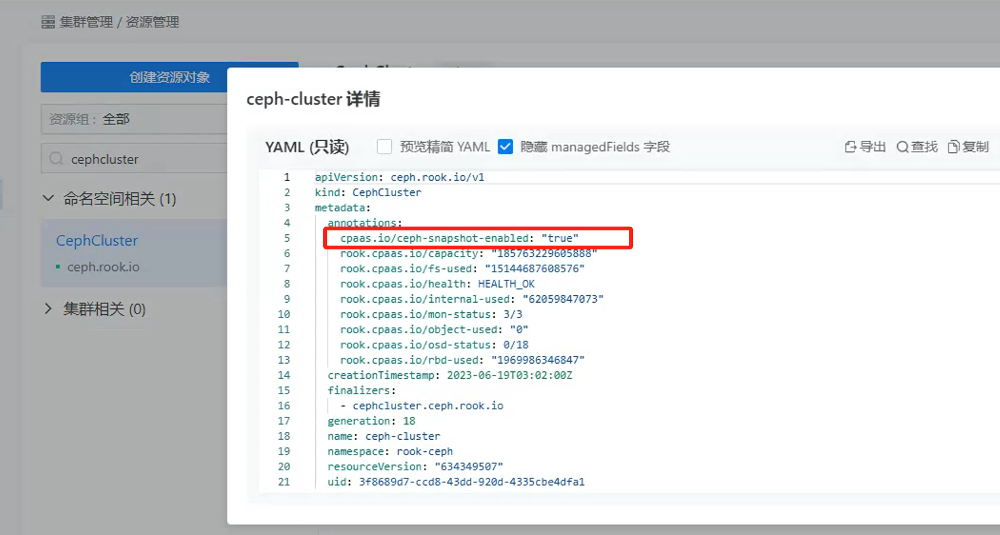
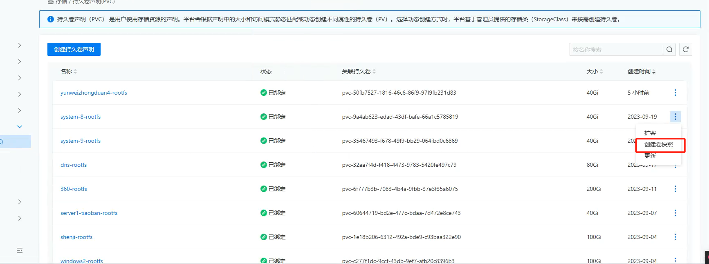

---
kind:
  - Troubleshooting
products:
  - Alauda Container Platform
  - Alauda DevOps
  - Alauda AI
  - Alauda Application Services
  - Alauda Service Mesh
  - Alauda Developer Portal
ProductsVersion:
  - 4.1.0,4.2.x
---
<!-- A type of document that involves encountering a fault, diagnosing it, performing root cause analysis, and providing solutions. -->

# ceph部署后如何开启快照功能

部署后无法通过界面进行快照的开启

## Cause
- 默认创建Ceph集群时未启用快照功能

## Resolution
- 通过集群-插件-部署卷快照插件
- 创建VolumeSnapshotClass资源并应用指定YAML配置
- 更新CephCluster资源增加cpaas.io/ceph-snapshot-enabled: "true"注解

## [workaround]

## [Related Information]
**Screenshots**

- Environment: 3.12
- VolumeSnapshotClass
- rook-ceph.rbd.csi.ceph.com
- clusterID
- rook-csi-rbd-provisioner
- rook-ceph
- cpaas.io/ceph-snapshot-enabled
- Component: Ceph
- Page ID: 247497915
- Original Title: ceph部署后如何开启快照功能
