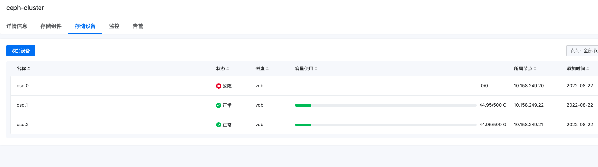
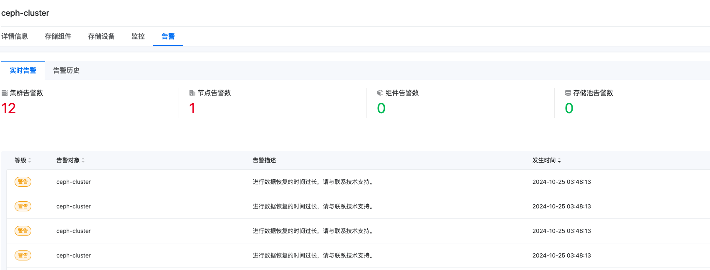
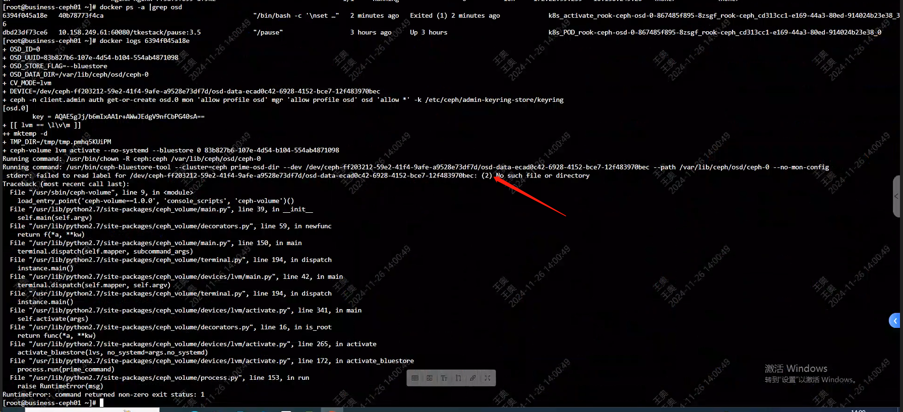
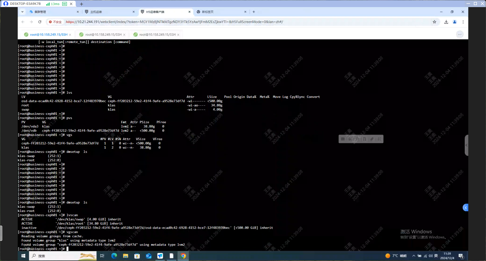
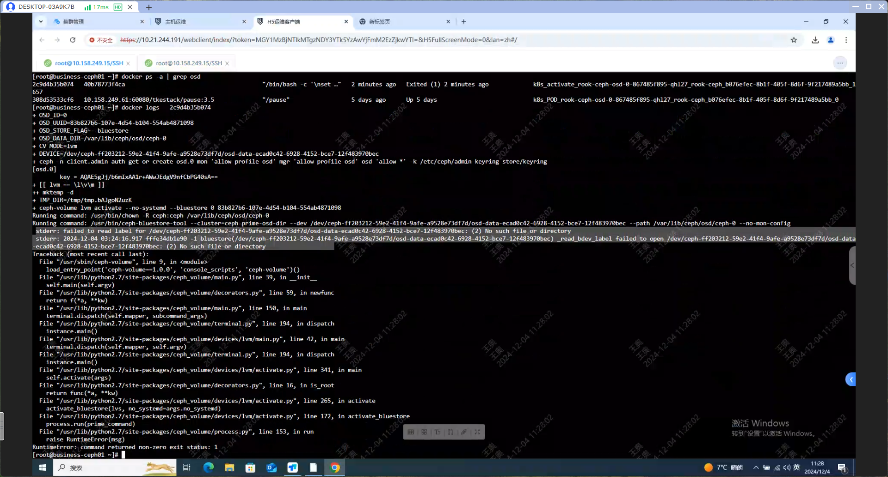

---
kind:
  - Troubleshooting
products:
  - Alauda Container Platform
  - Alauda DevOps
  - Alauda AI
  - Alauda Application Services
  - Alauda Service Mesh
  - Alauda Developer Portal
ProductsVersion:
  - 4.1.0,4.2.x
---
<!-- A type of document that involves encountering a fault, diagnosing it, performing root cause analysis, and providing solutions. -->

# osd异常，卡在init：crashloopbackup状态

OSD卡在init:crashloopbackoff状态 日志报错找不到ceph磁盘资源

## Cause
- ceph的LVM映射关系丢失导致vdb下缺少ceph的lvm资源

## Resolution
- 执行命令激活逻辑卷：lvchange -ay /dev/ceph-ff2032

## [workaround]

## [Related Information]
**Screenshots**

- Environment: 3.8.1
- /dev/ceph-ff2032
- vdb磁盘
- LVM
- ceph-osd组件
- Component: Ceph
- Page ID: 250446907
- Original Title: 容器平台-存储-ceph文件存储-osd异常，卡在init：crashloopbackup状态 -94125
