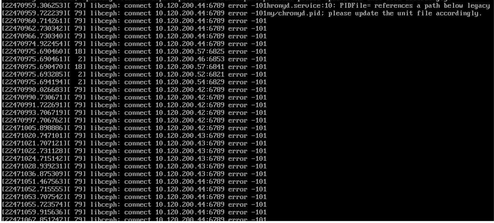

---
kind:
  - Troubleshooting
products:
  - Alauda Container Platform
  - Alauda DevOps
  - Alauda AI
  - Alauda Application Services
  - Alauda Service Mesh
  - Alauda Developer Portal
ProductsVersion:
  - 4.1.0,4.2.x
---
<!-- A type of document that involves encountering a fault, diagnosing it, performing root cause analysis, and providing solutions. -->

# 修改 Global 集群 VIP 为 IPv6 地址后服务器连接异常问题解决

服务器连接异常 Ceph连接报错持续刷屏

## Cause
- 修改IPv6配置顺序错误导致配置冲突

## Resolution
- 注释网卡配置文件中的IPv6配置行（如`/etc/sysconfig/network - scripts/ifcfg - eth0`中`IPV6ADDR=xxxx:xxxx:xxxx:xxxx::xxxx`前加`#`）
- 执行网卡重启命令：`systemctl restart network`（CentOS/Red Hat）或`/etc/init.d/networking restart`（Debian/Ubuntu）
- 添加新的IPv6配置项（如`IPV6ADDR=新的IPv6地址`）
- 再次执行网卡重启命令

## [workaround]

## [Related Information]
**Screenshots**

- Environment: Alauda Container Platform 3.10.2, Kylin v10 sp1
- Ceph CSI
- tstack Ceph
- /etc/sysconfig/network - scripts/ifcfg - eth0
- IPV6ADDR
- Component: Ceph
- Page ID: 264800245
- Original Title: 基础架构-修改 Global 集群 VIP 为 IPv6 地址后服务器连接异常问题解决
