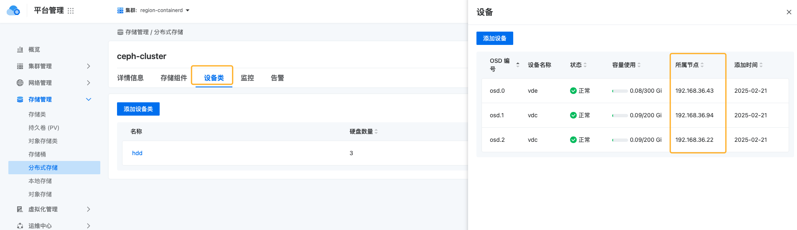
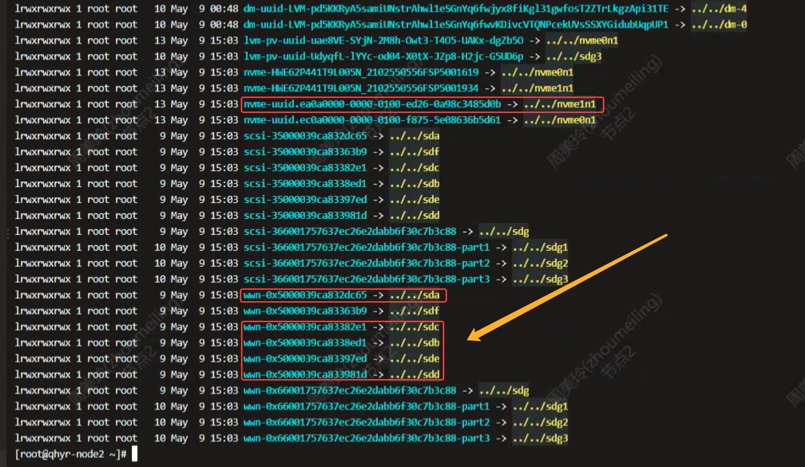
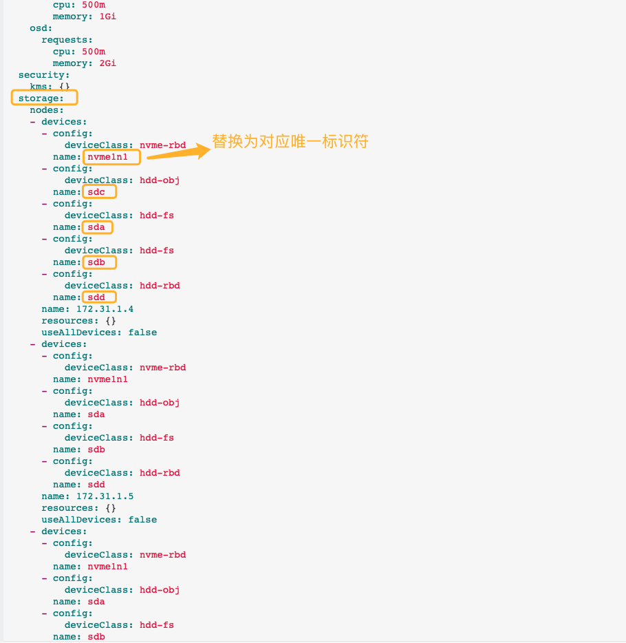
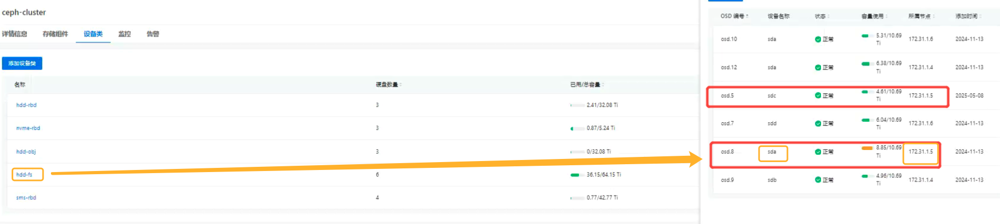
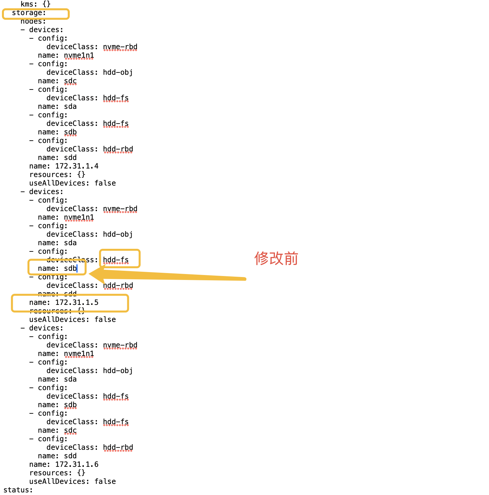
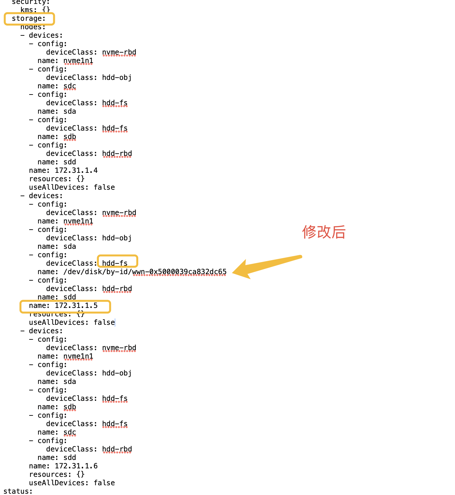
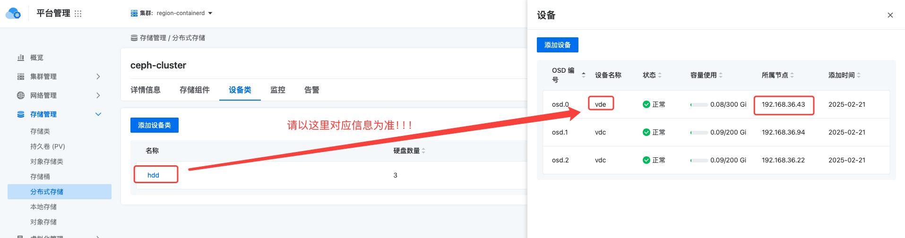
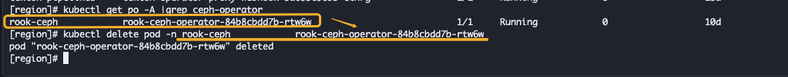

---
kind:
  - Troubleshooting
products:
  - Alauda Container Platform
  - Alauda DevOps
  - Alauda AI
  - Alauda Application Services
  - Alauda Service Mesh
  - Alauda Developer Portal
ProductsVersion:
  - 4.1.0,4.2.x
---
<!-- A type of document that involves encountering a fault, diagnosing it, performing root cause analysis, and providing solutions. -->

# 修改磁盘标识符

服务器重启后磁盘名称发生错乱 替换磁盘时需手动修改设备标识符导致操作繁琐且易出错

## Cause
- OSD配置使用了不稳定的设备名称（如sda）而非/dev/disk/by-id稳定标识符

## Resolution
- 通过ls -alh /dev/disk/by-id获取磁盘唯一标识符
- 使用kubectl edit cephcluster -n rook-ceph ceph-cluster修改存储设备配置路径为/dev/disk/by-id/<标识符>
- 重启ceph-operator的pod：kubectl delete pod -n xxxx xxxx

## [workaround]

## [Related Information]
**Screenshots**

- Environment: RE-v3.12.4
- /dev/disk/by-id
- cephcluster CRD
- rook-ceph命名空间
- ceph-operator pod
- Component: Ceph
- Page ID: 288522569
- Original Title: ceph文件存储-修改磁盘标识符
