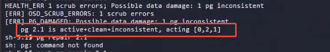

---kind:   - Troubleshootingproducts:    - Alauda Container Platform   - Alauda DevOps   - Alauda AI   - Alauda Application Services   - Alauda Service Mesh   - Alauda Developer PortalProductsVersion:   - 4.1.0,4.2.x---<!-- A type of document that involves encountering a fault, diag...it, performing root cause analysis, and providing solutions. --># cephceph-cluster告警:集群状态 故障 块pg数据不一致## Cause- ceph集群存在pg数据不一致问题## Resolution- 执行命令手动修复pg: ceph pg repair## [workaround]## [Related Information]**Screenshots**- Environment: 容器平台3.18.1- ceph-cluster- kubectl get po -A|grep ceph- ceph pg- pg数据不一致- Component: Ceph- Page ID: 324174937- Original Title: 容器平台-存储-ceph文件存储-ceph-cluster告警:集群状态 故障-113758