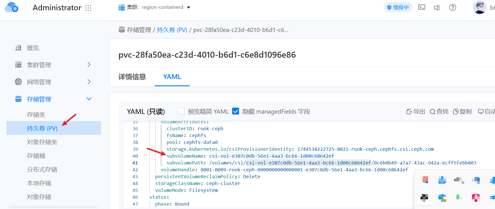

---
kind:
  - Troubleshooting
products:
  - Alauda Container Platform
  - Alauda DevOps
  - Alauda AI
  - Alauda Application Services
  - Alauda Service Mesh
  - Alauda Developer Portal
ProductsVersion:
  - 4.1.0,4.2.x
---
<!-- A type of document that involves encountering a fault, diagnosing it, performing root cause analysis, and providing solutions. -->

# 如何查看创建卷下的文件目录内容

无法直接访问创建卷（PVC）下的日志文件目录

## Cause
- 需要定位PVC对应的主机挂载目录

## Resolution
- 1. 查看关联PV的YAML，获取`subvolumeName`字段
- 2. 若PVC已挂载：到Pod调度节点执行`mount | grep <subvolumeName>`查询主机存储目录
- 3. 若PVC未挂载：需到Ceph存储节点逐个过滤查找
- 4. 通过`exec`进入容器使用平台文件传输功能下载文件

## [workaround]

## [Related Information]
**Screenshots**

- Environment: 3.12.1
- PVC
- PV
- Ceph存储
- 存储类
- subvolumeName字段
- Component: Ceph
- Page ID: 327285215
- Original Title: 容器平台-存储-如何查看创建卷下的文件目录内容-113881
