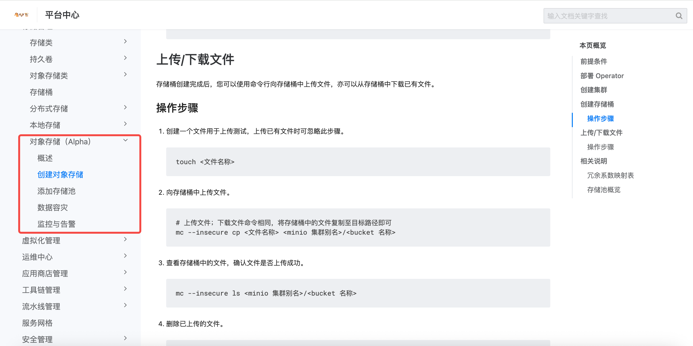
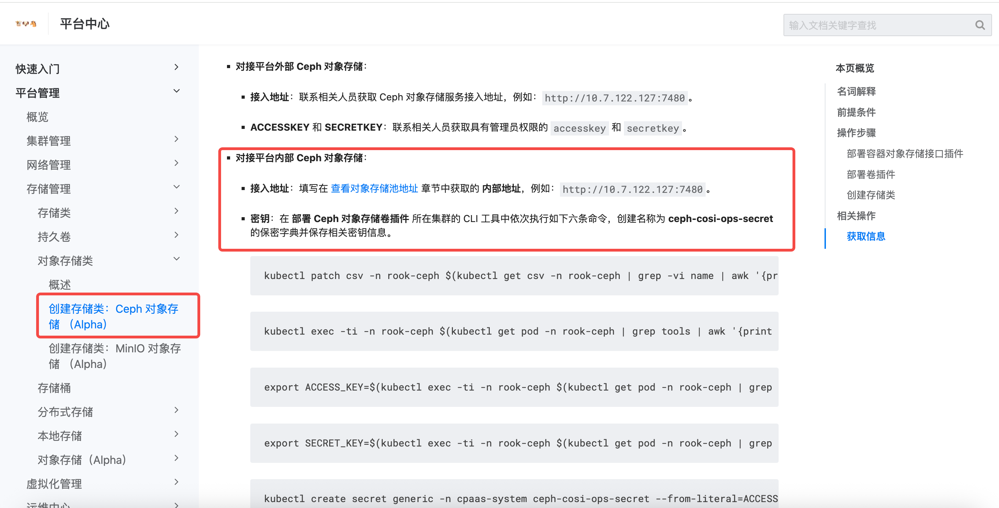

---
kind:
  - Troubleshooting
products:
  - Alauda Container Platform
  - Alauda DevOps
  - Alauda AI
  - Alauda Application Services
  - Alauda Service Mesh
  - Alauda Developer Portal
ProductsVersion:
  - 4.1.0,4.2.x
---
<!-- A type of document that involves encountering a fault, diagnosing it, performing root cause analysis, and providing solutions. -->

# 平台的Ceph对象存储如何使用

JIRA Jira：

## Cause

## Resolution

## [workaround]

## [Related Information]
**Screenshots**

- Environment: 3.16
- Component: Ceph
- Page ID: 330466271
- Original Title: 容器平台-存储-ceph文件存储-平台的Ceph对象存储如何使用-114463
