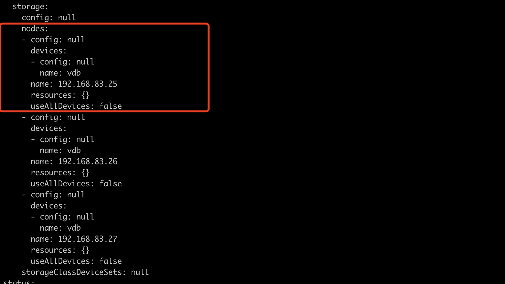

---
kind:
  - Troubleshooting
products:
  - Alauda Container Platform
  - Alauda DevOps
  - Alauda AI
  - Alauda Application Services
  - Alauda Service Mesh
  - Alauda Developer Portal
ProductsVersion:
  - 4.1.0,4.2.x
---
<!-- A type of document that involves encountering a fault, diagnosing it, performing root cause analysis, and providing solutions. -->

# [rook

## 注意：该文档目前不适用于在创建存储时选择了添加所有空盘的情况。 ## 1、从 cephcluster 中删除要剔除的磁盘或者整个节点相关内容

## Cause

## Resolution
- 编辑CephCluster配置以删除磁盘或节点相关内容: `kubectl edit cephcluster -n rook-ceph ceph-cluster`
- 获取节点上的OSD ID: `kubectl -n rook-ceph get po -l app=rook-ceph-osd -o wide | grep <node-ip>`
- 删除OSD对应的Deployment: `kubectl -n rook-ceph delete deploy rook-ceph-osd-<osdid>`
- 在rook-ceph-tools Pod中执行Ceph命令: `ceph osd out osd.<id>`, `ceph osd crush remove osd.<id>`, `ceph auth del osd.<id>`, `ceph osd rm osd.<id>`
- 清理磁盘: `dmsetup remove /dev/mapper/ceph--xxxxx`, `sgdisk --zap-all /dev/vdb`, `dd if=/dev/zero of=/dev/vdb bs=1M count=100 oflag=direct,dsync`

## [workaround]

## [Related Information]
**Screenshots**

- Environment: Rook Ceph集群环境，涉及Kubernetes中的rook-ceph命名空间
- rook-ceph-osd
- rook-ceph-tools
- ceph osd.out
- ceph osd.crush.remove
- ceph auth.del
- ceph osd.rm
- /dev/mapper/ceph--xxxxx
- /dev/vdb
- Component: Ceph
- Page ID: 98861966
- Original Title: [rook-ceph] 删除 osd
