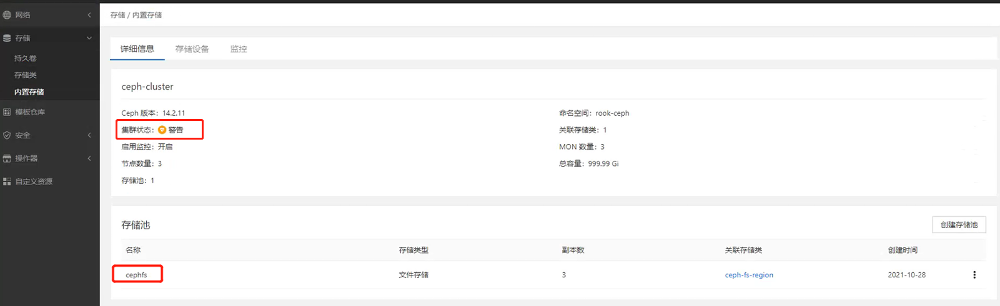
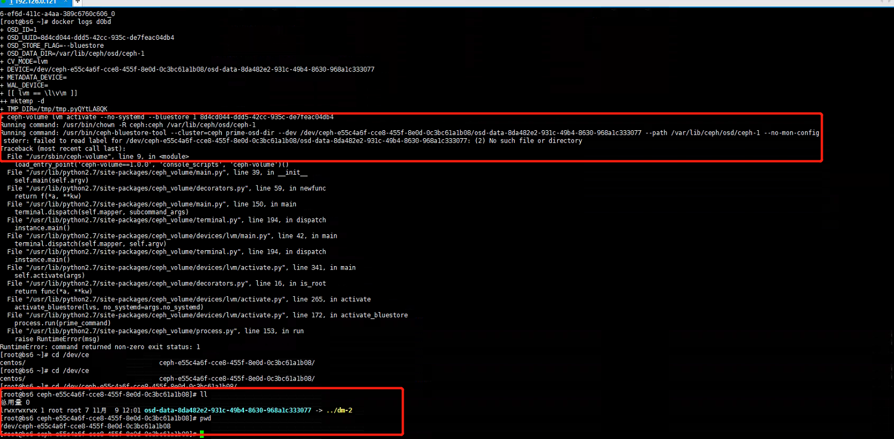

---
kind:
  - Troubleshooting
products:
  - Alauda Container Platform
  - Alauda DevOps
  - Alauda AI
  - Alauda Application Services
  - Alauda Service Mesh
  - Alauda Developer Portal
ProductsVersion:
  - 4.1.0,4.2.x
---
<!-- A type of document that involves encountering a fault, diagnosing it, performing root cause analysis, and providing solutions. -->

# 内置存储告警

内置存储界面提示告警 osd只运行了2个节点，1个节点上无osd服务 osd启动失败，日志显示无法找到相关挂载路径

## Cause
- 误删除操作导致节点本地ceph磁盘已被占用
- 残留挂载路径导致osd服务无法正常启动

## Resolution
- 删除并重建rook-ceph命名空间下的ceph-operators资源: kubectl delete pod -nrook-ceph '..operatpr'
- 在对应节点执行dmsetup remove解除残留挂载: dmsetup remove ceph--e55c4a6f--cce8--455f--8e0d--0c3bc61a1b08-osd--data--8da482e2--931c--49b4--8630--968a1c333077
- 重建osd服务

## [workaround]

## [Related Information]
**Screenshots**

- Environment: 通用版本内置存储Ceph
- rook-ceph命名空间
- ceph-operators
- dmsetup命令
- /var/lib/rook/osd-data
- kubectl get pod -nrook-ceph |grep operators
- Component: Ceph
- Page ID: 98876971
- Original Title: 内置存储告警-ceph-osd服务无法启动
