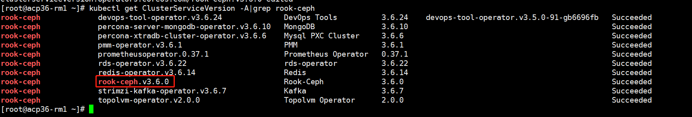
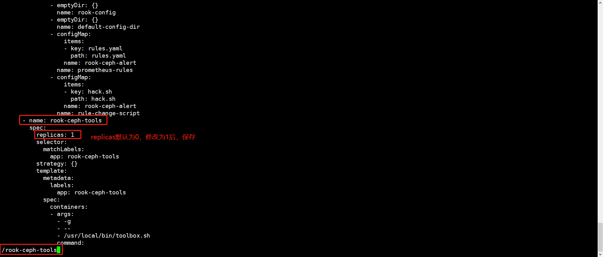

---
kind:
  - Troubleshooting
products:
  - Alauda Container Platform
  - Alauda DevOps
  - Alauda AI
  - Alauda Application Services
  - Alauda Service Mesh
  - Alauda Developer Portal
ProductsVersion:
  - 4.1.0,4.2.x
---
<!-- A type of document that involves encountering a fault, diagnosing it, performing root cause analysis, and providing solutions. -->

# 内存存储故障

内置存储提示检查状态为故障 监控详情未发现异常 rook-ceph命名空间下无异常pod

## Cause
- Ceph存储的PG（Placement Group）损坏

## Resolution
- kubectl get ClusterServiceVersion -A|grep rook-ceph
- kubectl edit ClusterServiceVersion -n rook-ceph rook-ceph.v3.6.0
- kubectl -n rook-ceph exec -it $(kubectl -n rook-ceph get pod -l "app=rook-ceph-tools" -o jsonpath='{.items[0].metadata.name}') -- /bin/bash
- 执行 ceph -s 检查存储状态
- 通过 ceph pg ls 检查异常PG
- 使用 ceph pg repair ‘pgid’ 修复异常PG

## [workaround]

## [Related Information]
**Screenshots**
/

- Environment: Kubernetes集群，rook-ceph命名空间，版本3.4
- rook-ceph-tools
- ClusterServiceVersion
- ceph -s
- ceph pg ls
- ceph pg repair
- Component: Ceph
- Page ID: 98876976
- Original Title: 内存存储故障-内置存储提示检查状态为故障
