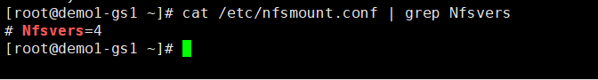
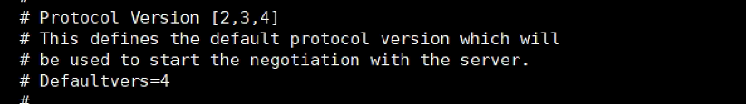
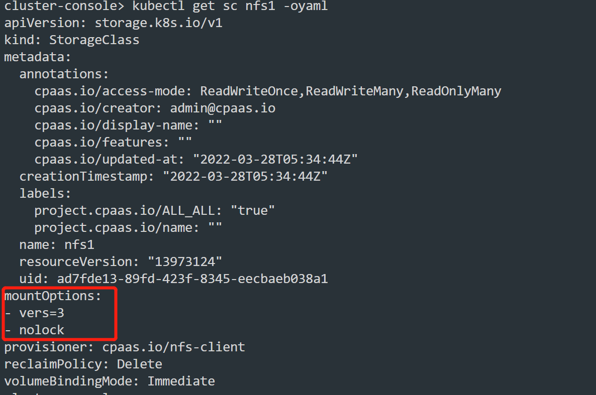

---
kind:
  - Troubleshooting
products:
  - Alauda Container Platform
  - Alauda DevOps
  - Alauda AI
  - Alauda Application Services
  - Alauda Service Mesh
  - Alauda Developer Portal
ProductsVersion:
  - 4.1.0,4.2.x
---
<!-- A type of document that involves encountering a fault, diagnosing it, performing root cause analysis, and providing solutions. -->

# pod挂载存储指定nfs版本

pod挂载存储时nfs协议版本不匹配

## Cause
- 平台默认使用nfs v4协议，客户环境使用nfs v3协议

## Resolution
- 修改nfs宿主机的/etc/nfsmount.conf配置Nfsevers参数并重启nfs服务
- 修改挂载nfs存储的宿主机/etc/nfsmount.conf配置Defaultvers参数
- 修改stroageclass资源配置设置mountOptions.vers参数

## [workaround]

## [Related Information]
**Screenshots**

- Environment: 3.8以上
- stroageclass.mountOptions.vers
- /etc/nfsmount.conf
- nfsstat -m
- nfs服务重启
- Component: NFS
- Page ID: 112047150
- Original Title: 容器平台-pod挂载存储指定nfs版本
