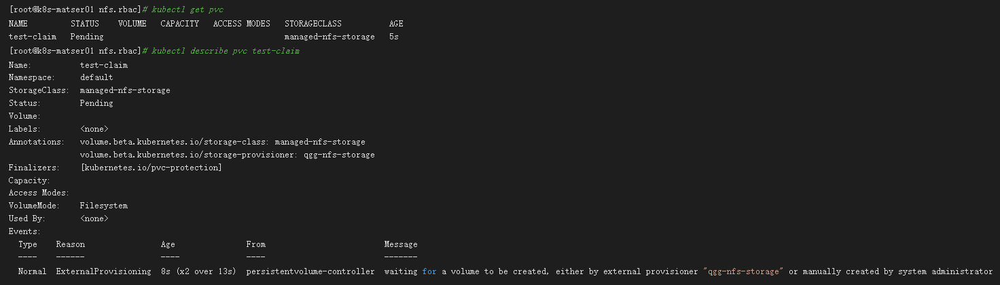

---
kind:
  - Troubleshooting
products:
  - Alauda Container Platform
  - Alauda DevOps
  - Alauda AI
  - Alauda Application Services
  - Alauda Service Mesh
  - Alauda Developer Portal
ProductsVersion:
  - 4.1.0,4.2.x
---
<!-- A type of document that involves encountering a fault, diagnosing it, performing root cause analysis, and providing solutions. -->

# 对接ifs/nfs存储类

persistentvolume-controller waiting for a volume to be created, either by external provisioner "qgg-nfs-storage" or manually created by system administrator

## Cause
- Kubernetes v1.20+ removed metadata.selfLink field which is required by nfs-client-provisioner

## Resolution
- Modify /etc/kubernetes/manifests/kube-apiserver.yaml to add `- --feature-gates=RemoveSelfLink=false` in command arguments
- Restart kube-apiserver container via `docker rm -f <container_id>`

## [workaround]

## [Related Information]
**Screenshots**

- Environment: Kubernetes versions before 1.24 (versions 1.24+ do not support this fix)
- kube-apiserver
- nfs-client-provisioner
- metadata.selfLink
- --feature-gates
- Component: NFS
- Page ID: 120107282
- Original Title: 对接ifs/nfs存储类-创建pv报错persistentvolume-controller  waiting for a volume to be created, either by external provisioner "qgg-nfs-storage" or manually created by system administrator
