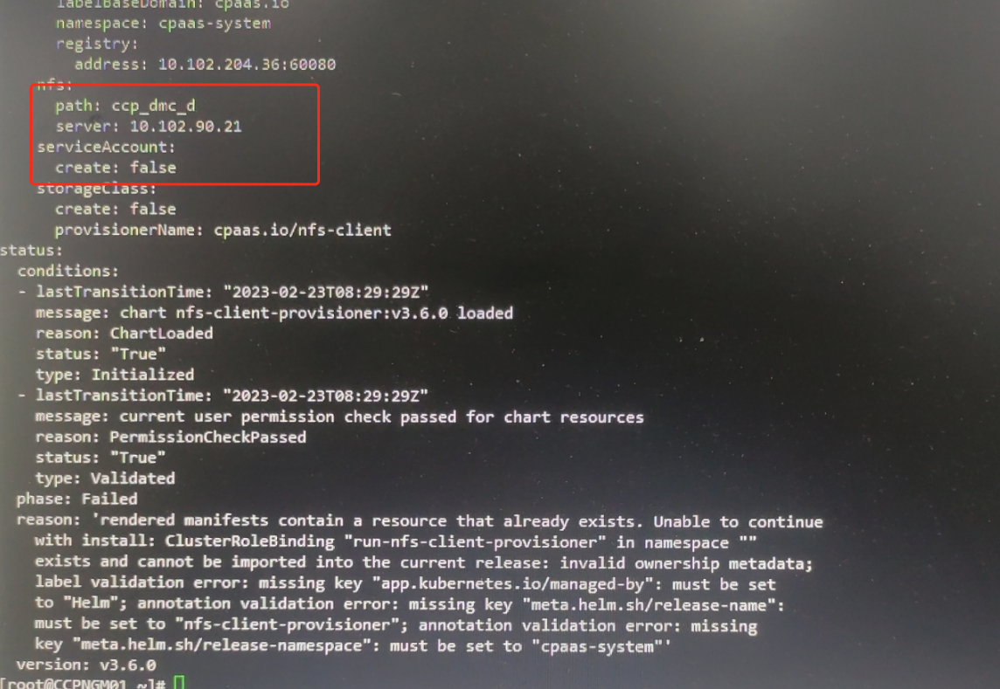
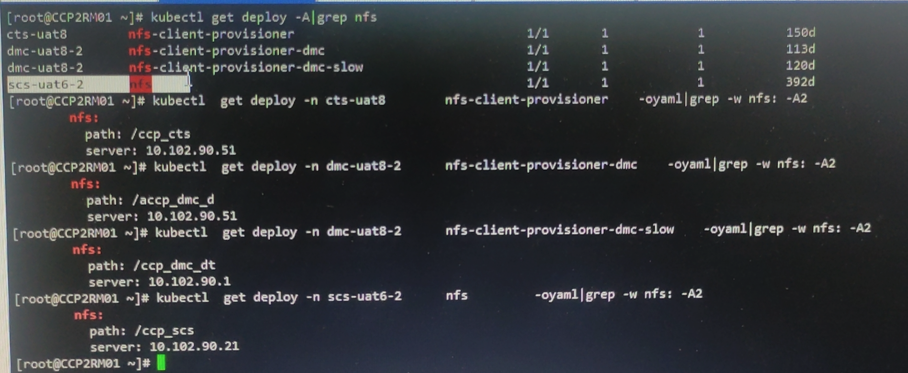
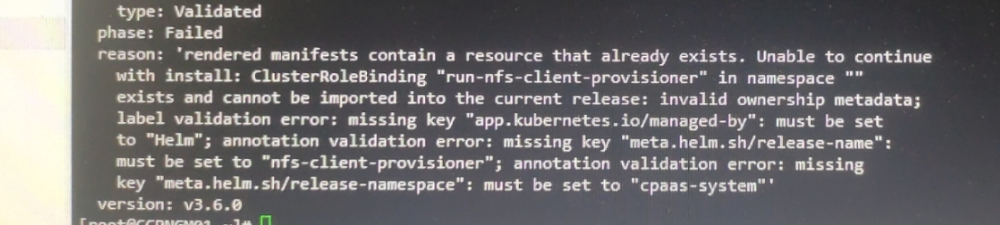

---
kind:
  - Troubleshooting
products:
  - Alauda Container Platform
  - Alauda DevOps
  - Alauda AI
  - Alauda Application Services
  - Alauda Service Mesh
  - Alauda Developer Portal
ProductsVersion:
  - 4.1.0,4.2.x
---
<!-- A type of document that involves encountering a fault, diagnosing it, performing root cause analysis, and providing solutions. -->

# 业务集群功能组件中显示nfs

nfs-updater运行异常

## Cause
- 平台版本不支持对接多个nfs存储类
- 业务集群nfs-provisioner配置与global集群hr资源地址路径不一致
- 业务集群存在同名provisioner导致hr资源未正常创建

## Resolution
- 删除异常的nfs hr资源

## [workaround]

## [Related Information]
**Screenshots**

- Environment: 3.6.1
- nfs-updater
- nfs-provisioner
- hr资源
- cpaas-system命名空间
- Component: NFS
- Page ID: 140807677
- Original Title: 业务集群功能组件中显示nfs-updater运行异常
