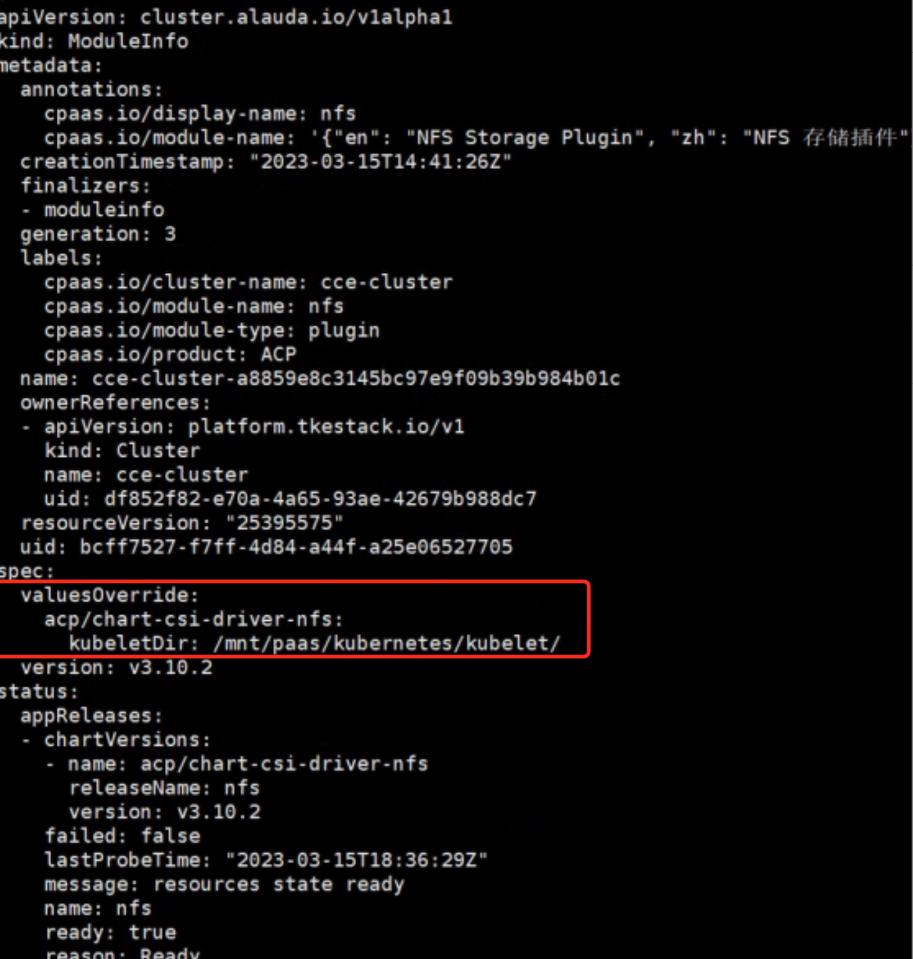

---
kind:
  - Troubleshooting
products:
  - Alauda Container Platform
  - Alauda DevOps
  - Alauda AI
  - Alauda Application Services
  - Alauda Service Mesh
  - Alauda Developer Portal
ProductsVersion:
  - 4.1.0,4.2.x
---
<!-- A type of document that involves encountering a fault, diagnosing it, performing root cause analysis, and providing solutions. -->

# cce集群nfs存储类使用配置调整

NFS存储类无法正常使用

## Cause
- kubelet安装路径被修改为/mnt/paas/kubernetes/kubelet，与csi-driver-nfs默认配置路径/var/lib/kubelet不一致

## Resolution
- kubectl get minfo | grep nfs | grep <region_name>
- kubectl edit minfo xxx 修改valuesoverride字段中的kubeletDir配置为/mnt/paas/kubernetes/kubelet

## [workaround]

## [Related Information]
**Screenshots**

- Environment: 3.10.x
- csi-driver-nfs
- kubelet
- minfo资源
- valuesoverride
- kubeletDir
- Component: NFS
- Page ID: 140815873
- Original Title: cce集群nfs存储类使用配置调整
