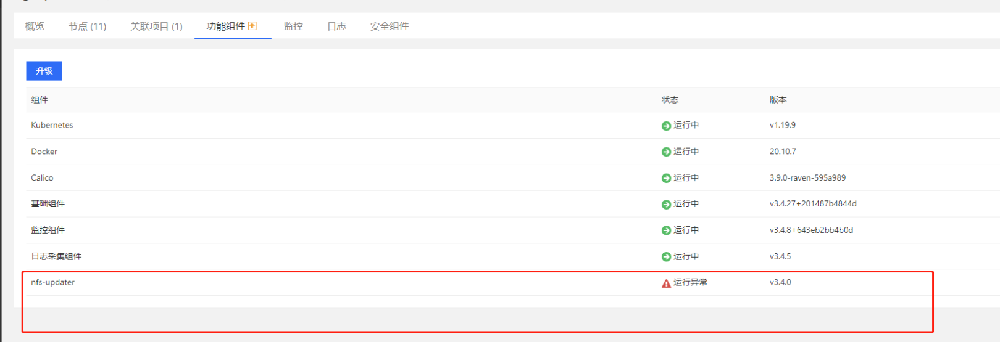
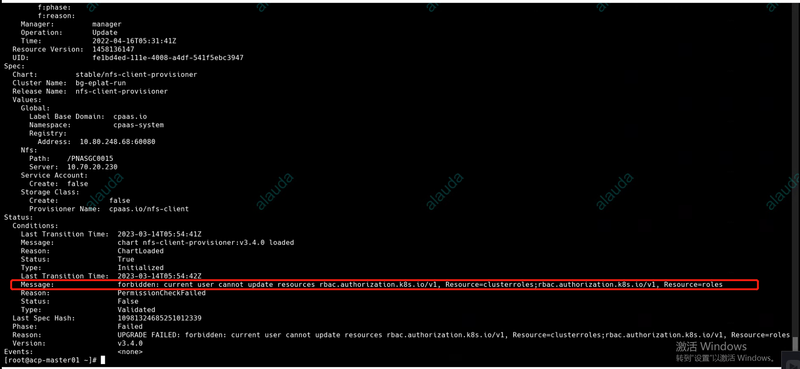
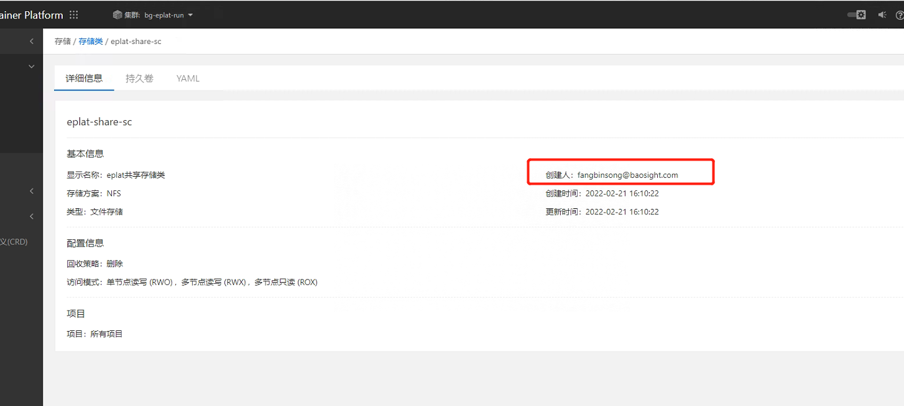
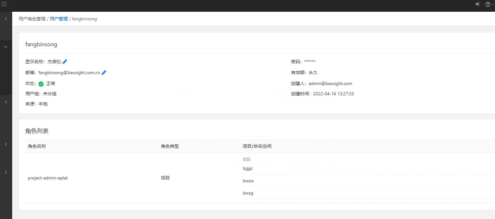
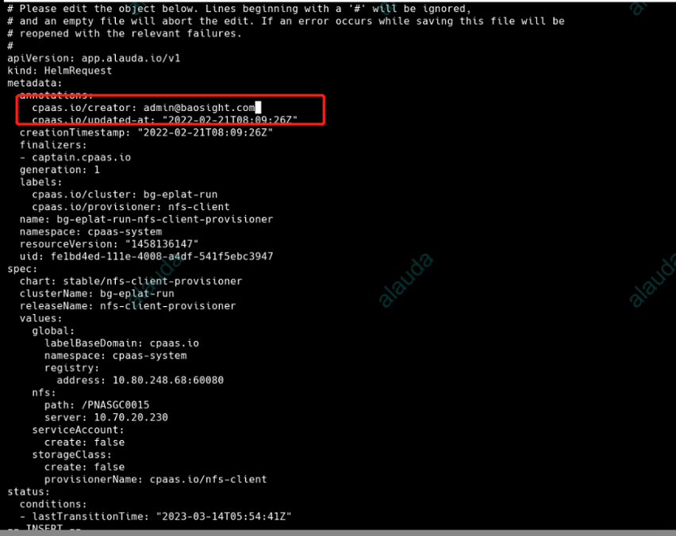

---
kind:
  - Troubleshooting
products:
  - Alauda Container Platform
  - Alauda DevOps
  - Alauda AI
  - Alauda Application Services
  - Alauda Service Mesh
  - Alauda Developer Portal
ProductsVersion:
  - 4.1.0,4.2.x
---
<!-- A type of document that involves encountering a fault, diagnosing it, performing root cause analysis, and providing solutions. -->

# 3.6

nfs-updater组件运行异常 kubectl get minfo -A显示创建人邮箱与用户邮箱不一致

## Cause
- 创建nfs的账户邮箱被更改导致原用户不存在

## Resolution
- 手动编辑集群nfs的hr资源，将创建者改为平台admin

## [workaround]

## [Related Information]
**Screenshots**

- nfs-updater
- minfo
- hr资源
- 创建者邮箱
- Component: NFS
- Page ID: 140825557
- Original Title: 3.6-集群功能组件nfs-updater运行异常
