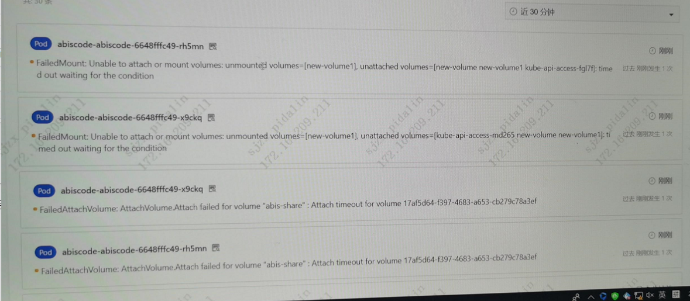
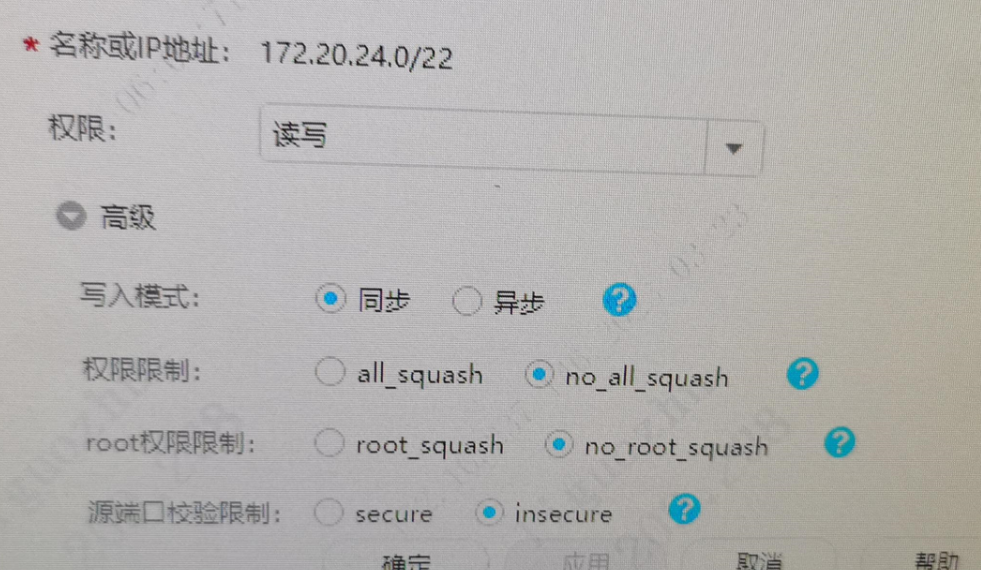

---
kind:
  - Troubleshooting
products:
  - Alauda Container Platform
  - Alauda DevOps
  - Alauda AI
  - Alauda Application Services
  - Alauda Service Mesh
  - Alauda Developer Portal
ProductsVersion:
  - 4.1.0,4.2.x
---
<!-- A type of document that involves encountering a fault, diagnosing it, performing root cause analysis, and providing solutions. -->

# 容器挂载nfs存储启动失败

FailedMount: Unable to attach or mount volumes unmounted volumes=[new-volume1] unattached volumes=[new-volume new-volume1 kube-api-access-fgl7f)

## Cause
- PV访问模式配置为多节点读写(RWX)导致挂载失败

## Resolution
- 将PV的访问模式从ReadWriteMany(RWX)修改为ReadWriteOnce(RWO)

## [workaround]

## [Related Information]
**Screenshots**

- Environment: NFS存储环境
- pv
- pvc
- nfs
- accessModes
- Component: NFS
- Page ID: 140826970
- Original Title: 容器平台-容器挂载nfs存储启动失败
