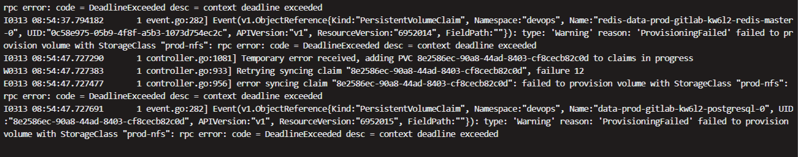
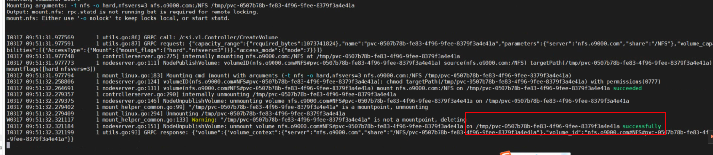

---
kind:
  - Troubleshooting
products:
  - Alauda Container Platform
  - Alauda DevOps
  - Alauda AI
  - Alauda Application Services
  - Alauda Service Mesh
  - Alauda Developer Portal
ProductsVersion:
  - 4.1.0,4.2.x
---
<!-- A type of document that involves encountering a fault, diagnosing it, performing root cause analysis, and providing solutions. -->

# 对接商业nas存储后创建PVC失败

创建PVC失败，报错"failed to provision volume with storageclass xxx : rpc error: context deadline exceeded" csi-nfs-node容器日志报错"rpc.statd is not running"

## Cause
- 节点rpcbind服务未启动

## Resolution
- 在节点上启动rpcbind服务

## [workaround]

## [Related Information]
**Screenshots**

- Environment: 3.10.2
- csi-nfs-node
- nfs-utils
- rpcbind
- storageclass
- Component: NFS
- Page ID: 146362455
- Original Title: 对接商业nas存储后创建PVC失败
