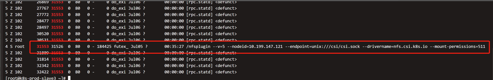
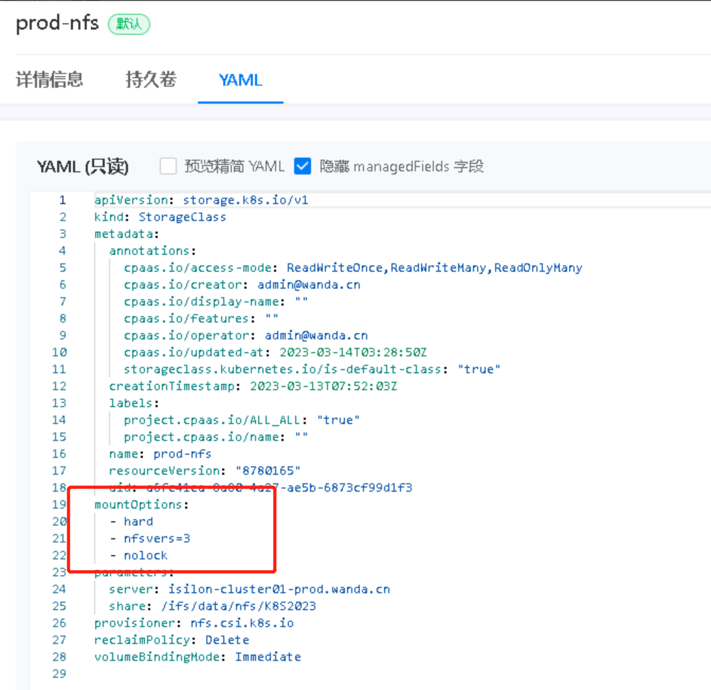

---
kind:
  - Troubleshooting
products:
  - Alauda Container Platform
  - Alauda DevOps
  - Alauda AI
  - Alauda Application Services
  - Alauda Service Mesh
  - Alauda Developer Portal
ProductsVersion:
  - 4.1.0,4.2.x
---
<!-- A type of document that involves encountering a fault, diagnosing it, performing root cause analysis, and providing solutions. -->

# 3.12.1

节点上发现大量的僵尸进程，父进程为nfs存储类插件

## Cause
- nfs存储类插件在mount操作异常时产生rpcd僵尸进程
- NFS客户端与服务器之间的网络通信中断或超时

## Resolution
- 在存储类添加mount option '-o nolock'
- 增加NFS挂载参数timeo=300和retrans=5

## [workaround]

## [Related Information]
**Screenshots**

- Environment: 3.12.1
- nfs存储类
- rpcd进程
- mount参数
- Component: NFS
- Page ID: 161385556
- Original Title: 3.12.1-由nfs存储类产生的僵尸进程
