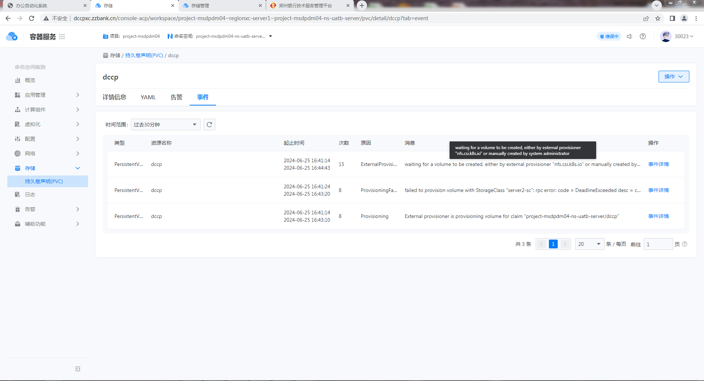

---
kind:
  - Troubleshooting
products:
  - Alauda Container Platform
  - Alauda DevOps
  - Alauda AI
  - Alauda Application Services
  - Alauda Service Mesh
  - Alauda Developer Portal
ProductsVersion:
  - 4.1.0,4.2.x
---
<!-- A type of document that involves encountering a fault, diagnosing it, performing root cause analysis, and providing solutions. -->

# 创建NFS共享存储，创建PVC报错

无法在平台中正常使用NFS共享存储，本地可挂载但创建PVC报错

## Cause
- nfs csi的Deployment和DaemonSet中readonlyRootFilesystem参数被设置为true

## Resolution
- 修改nfs csi的Deployment和DaemonSet配置，将readonlyRootFilesystem设置为false

## [workaround]

## [Related Information]
**Screenshots**

- nfs-csi
- Deployment
- DaemonSet
- readonlyRootFilesystem
- Component: NFS
- Page ID: 221874997
- Original Title: 创建NFS共享存储，创建PVC报错
