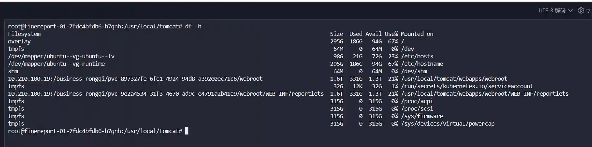
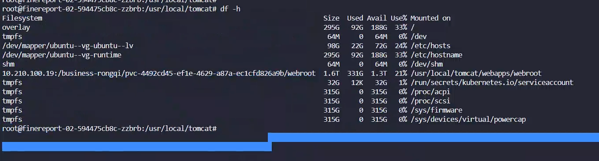
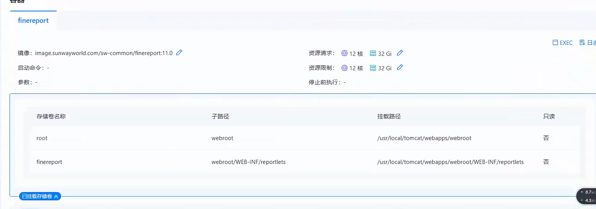
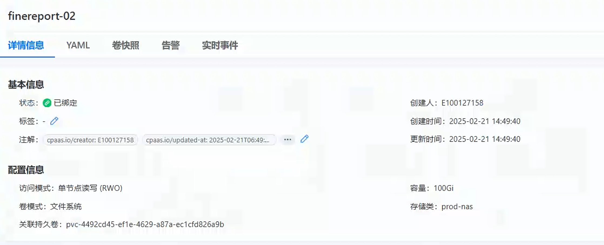
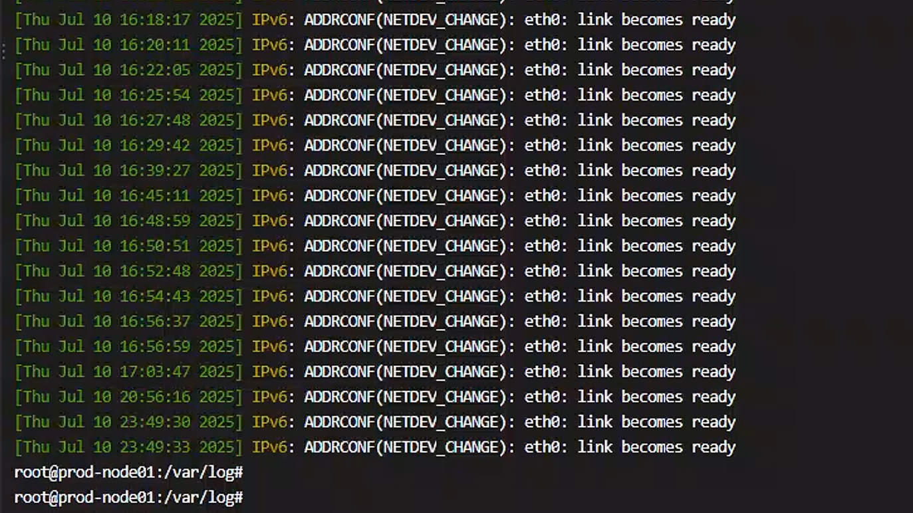
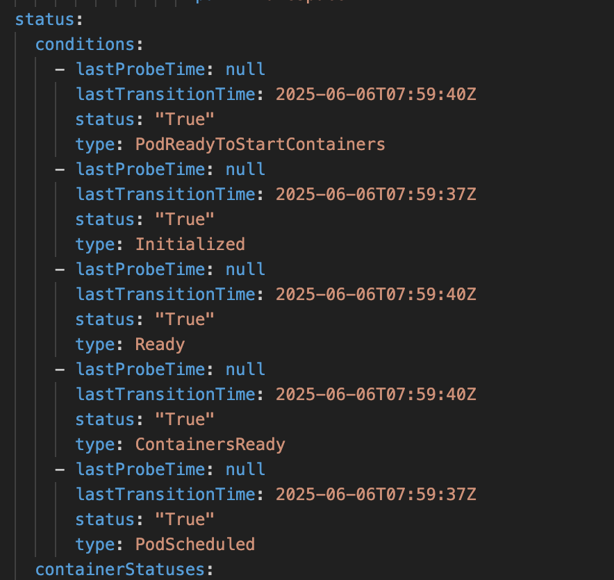

---
kind:
  - Troubleshooting
products:
  - Alauda Container Platform
  - Alauda DevOps
  - Alauda AI
  - Alauda Application Services
  - Alauda Service Mesh
  - Alauda Developer Portal
ProductsVersion:
  - 4.1.0,4.2.x
---
<!-- A type of document that involves encountering a fault, diagnosing it, performing root cause analysis, and providing solutions. -->

# 生产环境 pod 服务技巧nfs 掉盘

两个业务pod中的pvc存储卷丢失 未重启的pod缺少/webroot下的子路径 内核日志显示NFS服务器10.210.100.19在07日10:37:15至10:38:59期间无响应

## Cause
- NFS服务器10.210.100.19发生短暂连接中断(持续1分44秒)
- 存在嵌套挂载配置：/usr/local/tomcat/webapps/webroot 和 /usr/local/tomcat/webapps/webroot/WEB-INF/reportlets
- 业务侧缺乏对挂载状态的实时监控机制

## Resolution
- 增加NFS server端口的黑盒监控(默认端口2049)
- 调整业务配置取消嵌套挂载
- 优化业务对存储挂载状态的检测机制

## [workaround]
- 重启受影响的pod恢复业务
- 保留故障现场用于分析：kubectl describe pod <podname>

## [Related Information]
**Screenshots**

- Environment: 容器平台3.18.1版本
- nfs-client
- 10.210.100.19:2049
- /usr/local/tomcat/webapps/webroot
- volumeMounts.subPath
- dmesg -T
- journalctl
- Component: NFS
- Page ID: 324174036
- Original Title: 容器平台-存储-nfs存储-生产环境 pod 服务技巧nfs 掉盘-112759
