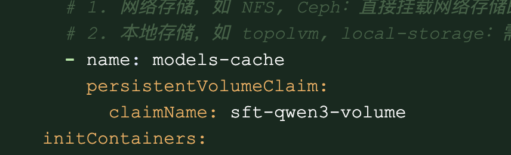

---
kind:
  - Troubleshooting
products:
  - Alauda Container Platform
  - Alauda DevOps
  - Alauda AI
  - Alauda Application Services
  - Alauda Service Mesh
  - Alauda Developer Portal
ProductsVersion:
  - 4.1.0,4.2.x
---
<!-- A type of document that involves encountering a fault, diagnosing it, performing root cause analysis, and providing solutions. -->

# AML 基于海光微调报错资源不足

报错资源不足 调整job的resource未生效

## Cause
- topolvm存储类与GPU节点不在同一节点导致调度失败
- 海光厂商镜像不支持git lfs命令

## Resolution
- 不指定storageclass改用NFS PV/PVC
- 定制支持git lfs的镜像

## [workaround]

## [Related Information]
**Screenshots**

- Environment: 4.0.1
- topolvm存储类
- nfs pv/pvc
- job yaml配置
- git lfs命令
- Component: NFS
- Page ID: 324174055
- Original Title: 微服务-AI-AML 基于海光微调报错资源不足-114001
