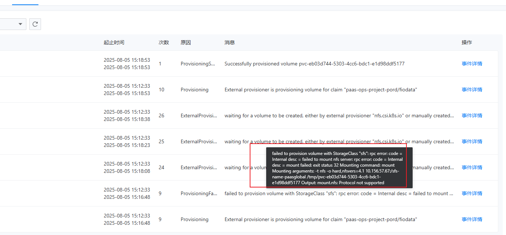
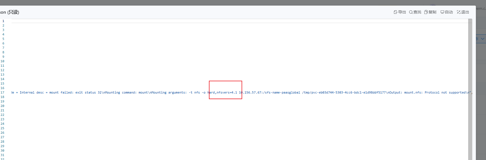

---
kind:
  - Troubleshooting
products:
  - Alauda Container Platform
  - Alauda DevOps
  - Alauda AI
  - Alauda Application Services
  - Alauda Service Mesh
  - Alauda Developer Portal
ProductsVersion:
  - 4.1.0,4.2.x
---
<!-- A type of document that involves encountering a fault, diagnosing it, performing root cause analysis, and providing solutions. -->

# 灵雀云nfs版本支持nfs协议

目前使用了一个测试集群，使用NFS插件，对接华为云的SFS服务（NFS类的文件服务），对接的时候协议版本使用v4，报错，不支持协议，v3可以

## Cause

## Resolution
- 2、如果要使用nfs v4协议对接，能否实现
- ## 解决方案

## [workaround]

## [Related Information]
**Screenshots**

- 11
- 14
- /rong-qi-ping-tai-cun-chu-nfscun-chu-ling-que-yun-nfsban-ben-zhi-chi-nfsxie-yi-11/1754378964_99781_bde377_nfs-1.png
- /rong-qi-ping-tai-cun-chu-nfscun-chu-ling-que-yun-nfsban-ben-zhi-chi-nfsxie-yi-11/1754378964_99781_d96c28_nfs-2.png
- Component: NFS
- Page ID: 327812460
- Original Title: 容器平台-存储-nfs存储-灵雀云nfs版本支持nfs协议-114445
