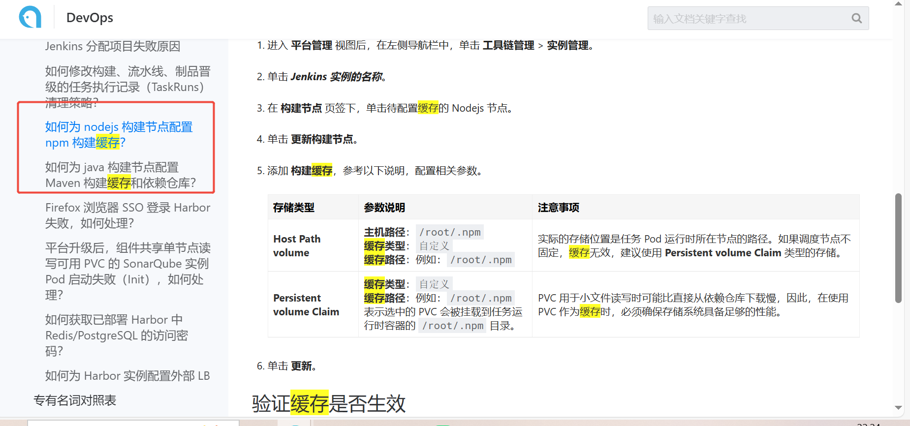
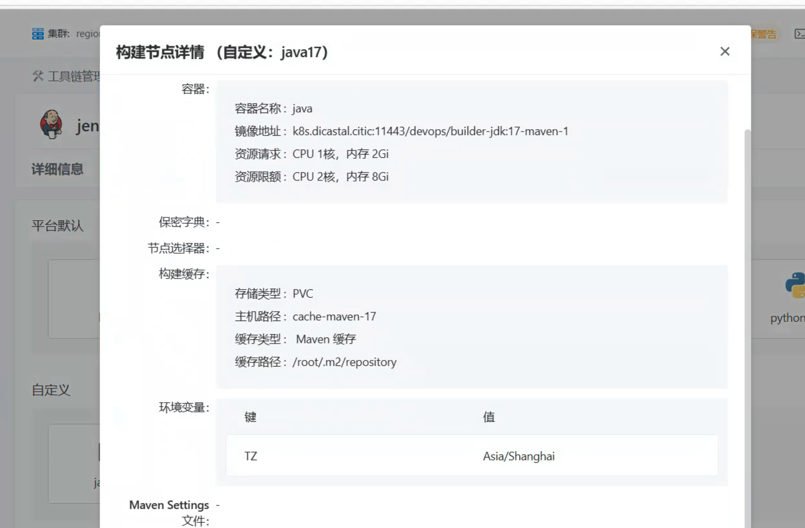
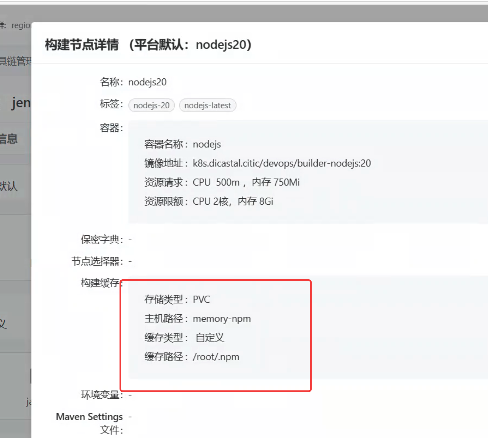

---
kind:
  - Troubleshooting
products:
  - Alauda Container Platform
  - Alauda DevOps
  - Alauda AI
  - Alauda Application Services
  - Alauda Service Mesh
  - Alauda Developer Portal
ProductsVersion:
  - 4.1.0,4.2.x
---
<!-- A type of document that involves encountering a fault, diagnosing it, performing root cause analysis, and providing solutions. -->

# Jenkins执行打包过程可否缓存依赖

流水线执行时卡在‘等待调度任务’阶段 配置Maven构建缓存后流水线无法正常执行

## Cause
- topolvm存储类与缓存配置存在兼容性问题
- 未正确配置持久化存储

## Resolution
- 参考DevOps流水线文档配置缓存路径
- 检查PVC配置与存储类兼容性
- 调整持久卷声明(PVC)设置

## [workaround]
- 暂时禁用依赖缓存功能
- 改用兼容的存储类替代topolvm

## [Related Information]
**Screenshots**

- Environment: v3.18.1 with topolvm storage class (no NFS)
- Jenkins
- Maven
- NPM
- Nexus
- PVC
- topolvm
- Component: NFS
- Page ID: 336396958
- Original Title: Devops-Jenkins执行打包过程可否缓存依赖-115636
