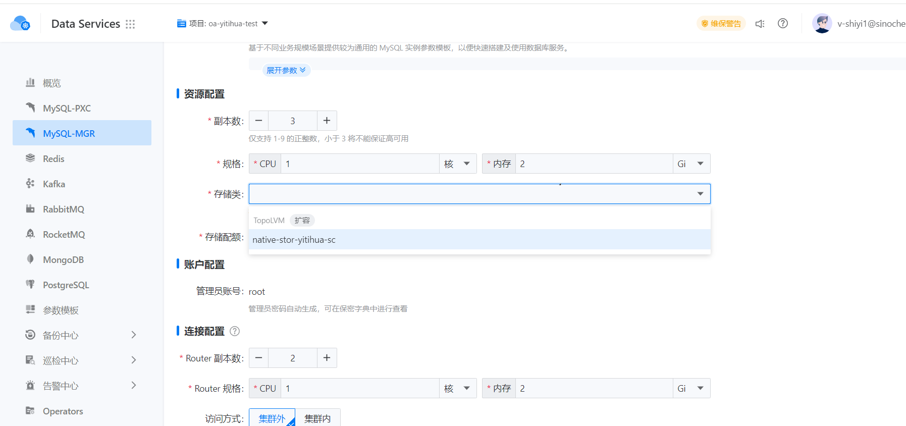
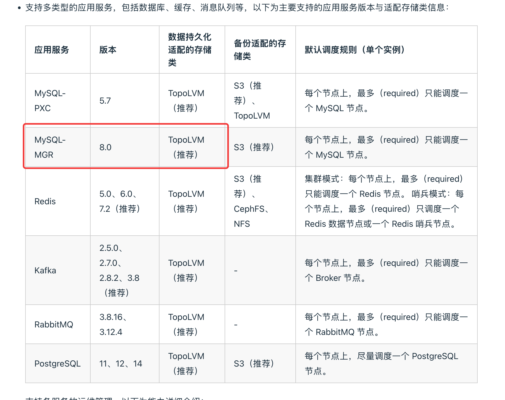

---
kind:
  - Troubleshooting
products:
  - Alauda Container Platform
  - Alauda DevOps
  - Alauda AI
  - Alauda Application Services
  - Alauda Service Mesh
  - Alauda Developer Portal
ProductsVersion:
  - 4.1.0,4.2.x
---
<!-- A type of document that involves encountering a fault, diagnosing it, performing root cause analysis, and providing solutions. -->

# dataservice中的mysql

无法在创建mysql-mgr时选择NFS存储类

## Cause
- 产品限制了mgr使用NFS存储

## Resolution
- 目前不支持使用NFS存储

## [workaround]
- 建议使用推荐的topolvm存储

## [Related Information]
**Screenshots**

- Environment: 3.14.1
- mysql-mgr
- 存储类配置
- NFS
- topolvm
- Component: NFS
- Page ID: 338919552
- Original Title: 数据服务-dataservice中的mysql-mgr如何才能支持NFS存储-114577
