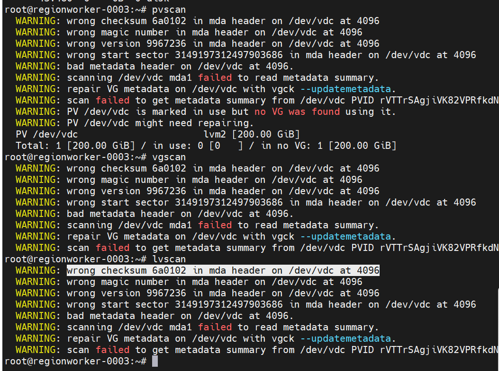

---
kind:
  - Troubleshooting
products:
  - Alauda Container Platform
  - Alauda DevOps
  - Alauda AI
  - Alauda Application Services
  - Alauda Service Mesh
  - Alauda Developer Portal
ProductsVersion:
  - 4.1.0,4.2.x
---
<!-- A type of document that involves encountering a fault, diagnosing it, performing root cause analysis, and providing solutions. -->

# topolvm 状态异常

topolvm-prepare-vg组件日志显示vdc磁盘不是裸盘状态 存储节点状态异常 无法显示容量

## Cause
- vdc磁盘未处于裸盘状态导致无法创建vg

## Resolution
- 更换磁盘并重新部署topolvm

## [workaround]
- 将存储节点磁盘恢复为裸盘状态后重新部署

## [Related Information]
**Screenshots**

- Environment: 3.16.0
- topolvm-prepare-vg
- vg
- pv
- lv
- /dev/vdc
- Component: topolvm存储
- Page ID: 210438484
- Original Title: 容器平台-存储-topolvm 状态异常
