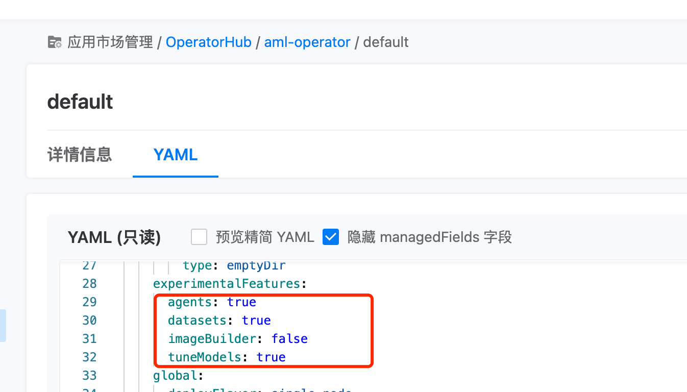
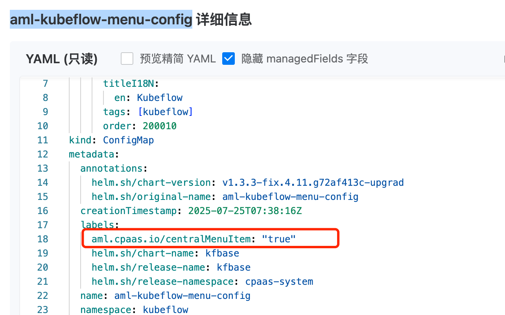
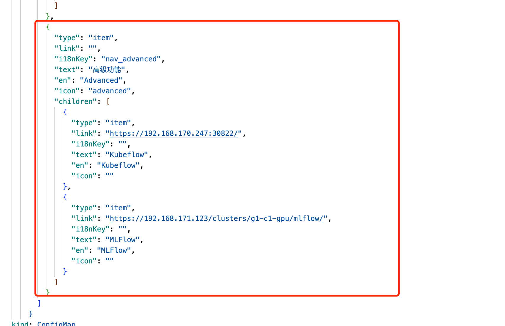

---
kind:
  - Troubleshooting
products:
  - Alauda Container Platform
  - Alauda DevOps
  - Alauda AI
  - Alauda Application Services
  - Alauda Service Mesh
  - Alauda Developer Portal
ProductsVersion:
  - 4.1.0,4.2.x
---
<!-- A type of document that involves encountering a fault, diagnosing it, performing root cause analysis, and providing solutions. -->

# 打开隐藏功能之后关闭隐藏功能

隐藏功能关闭后仍然可见 高级功能未正确隐藏

## Cause
- amlcluster资源中四个值未设置为false
- aml-kubeflow-menu-config configmap未修改/删除
- aml-centraldashboard-config configmap未清理高级功能配置

## Resolution
- 更新amlcluster资源将四个参数设为false
- 修改kubeflow命名空间aml-kubeflow-menu-config的metadata.labels值或删除该configmap
- 删除kube-public命名空间aml-centraldashboard-config中高级功能配置

## [workaround]

## [Related Information]
**Screenshots**

- Environment: Kubernetes集群运行Alauda AI和Kubeflow组件
- amlcluster
- aml-kubeflow-menu-config
- aml-centraldashboard-config
- kubeflow命名空间
- kube-public命名空间
- Component: ai
- Page ID: 333316583
- Original Title: 打开隐藏功能之后关闭隐藏功能
