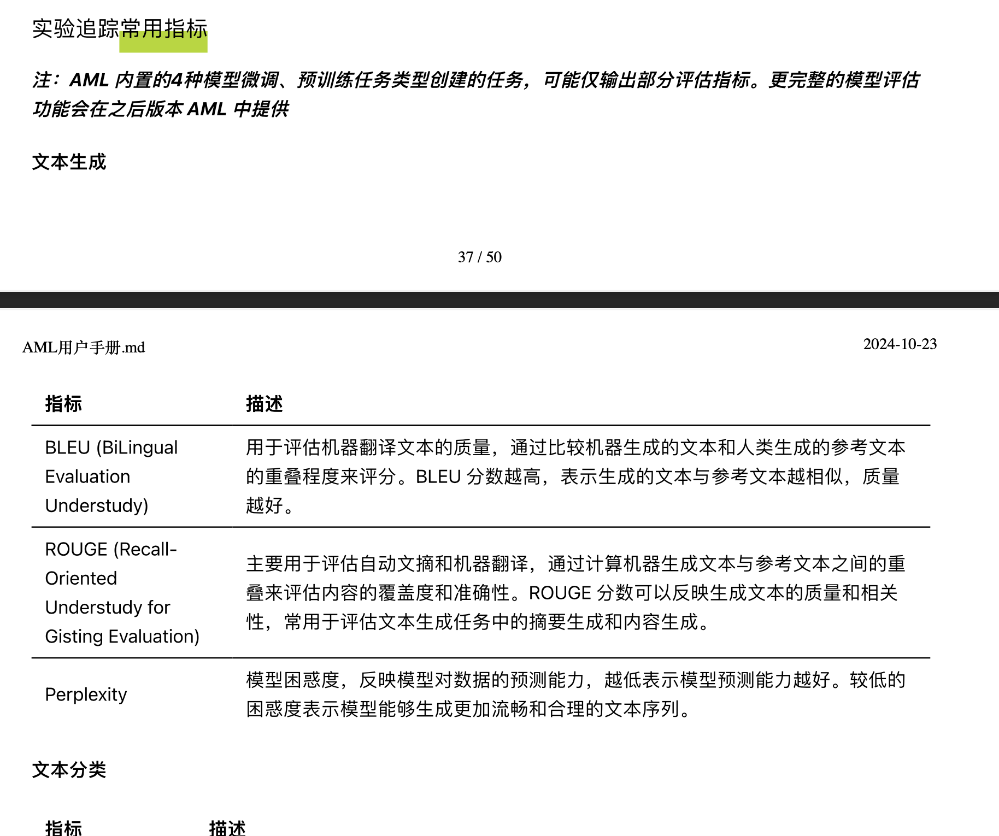

---
kind:
  - Troubleshooting
products:
  - Alauda Container Platform
  - Alauda DevOps
  - Alauda AI
  - Alauda Application Services
  - Alauda Service Mesh
  - Alauda Developer Portal
ProductsVersion:
  - 4.1.0,4.2.x
---
<!-- A type of document that involves encountering a fault, diagnosing it, performing root cause analysis, and providing solutions. -->

# aml lora 微调指标咨询

evalxxx指标缺失 无法访问用户手册中的模型训练实验追踪常用指标

## Cause
- 未配置验证集

## Resolution
- 确保训练时选择验证集
- 通过截图提供指标内容

## [workaround]

## [Related Information]
**Screenshots**

- Environment: 3.18.1
- 验证集配置
- 模型训练实验追踪常用指标文档
- Component: 云原生应用
- Page ID: 330465947
- Original Title: 微服务-云原生应用-aml lora 微调指标咨询-112561
