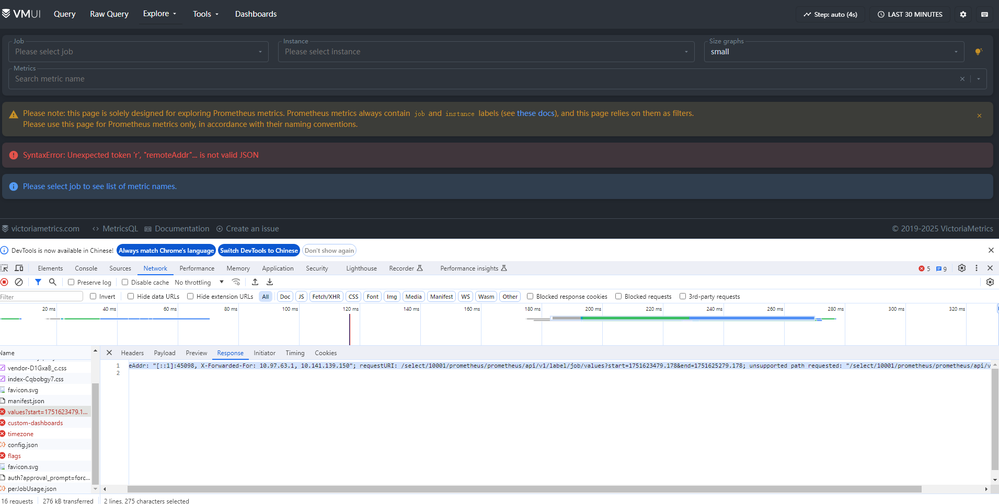
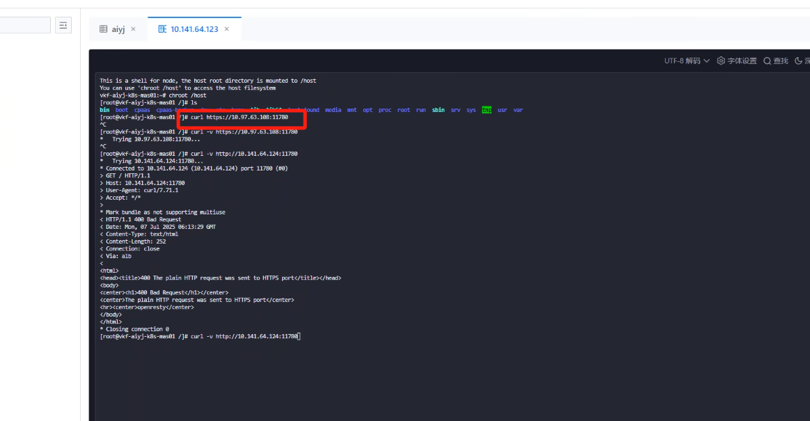
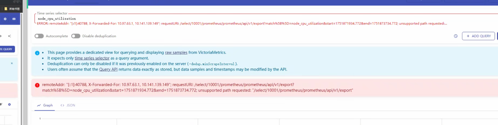
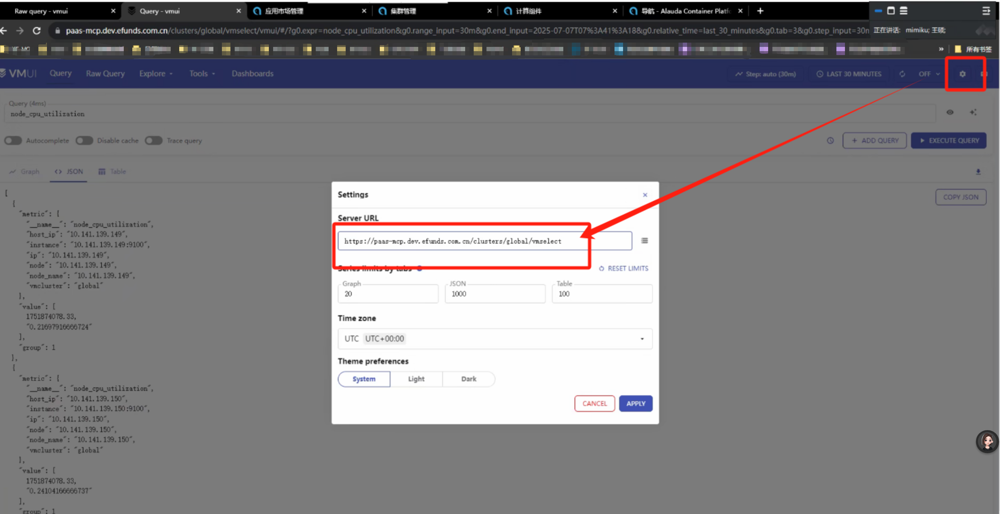

---
kind:
  - Troubleshooting
products:
  - Alauda Container Platform
  - Alauda DevOps
  - Alauda AI
  - Alauda Application Services
  - Alauda Service Mesh
  - Alauda Developer Portal
ProductsVersion:
  - 4.1.0,4.2.x
---
<!-- A type of document that involves encountering a fault, diagnosing it, performing root cause analysis, and providing solutions. -->

# VictoriaMetrics的ui查询界面vmui打开报错

访问vmui报错，界面无法查询指标

## Cause
- 业务集群到vip监控端口11780/11781无法通讯
- vmui界面默认获取了错误的prometheus路径

## Resolution
- 开通11780/11781端口通讯
- 手动修改url去掉末尾多余的prometheus路径

## [workaround]
- 每次登录需手动修改url路径参数

## [Related Information]
**Screenshots**

- Environment: 4.0.1
- 11780
- 11781
- prometheus路径配置
- Component: 监控告警通知巡检
- Page ID: 313033218
- Original Title: 基础架构-运维中心-监控告警通知巡检-VictoriaMetrics的ui查询界面vmui打开报错-112327
