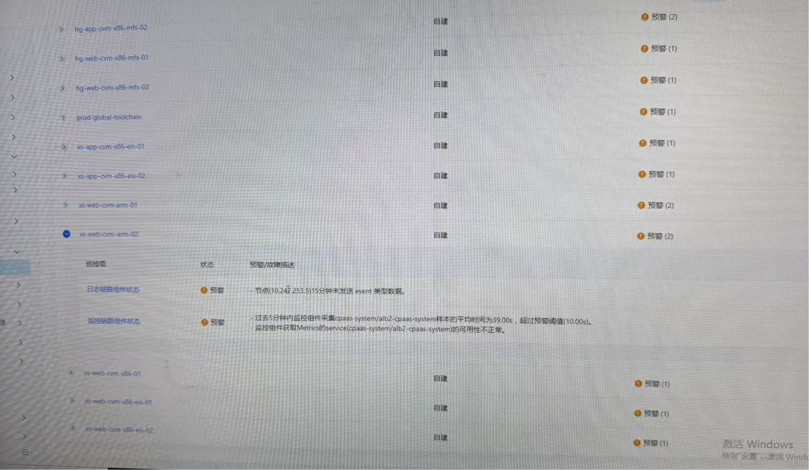

---
kind:
  - Troubleshooting
products:
  - Alauda Container Platform
  - Alauda DevOps
  - Alauda AI
  - Alauda Application Services
  - Alauda Service Mesh
  - Alauda Developer Portal
ProductsVersion:
  - 4.1.0,4.2.x
---
<!-- A type of document that involves encountering a fault, diagnosing it, performing root cause analysis, and providing solutions. -->

# 巡检中集群检查项显示：监控组件获取metric的可用性不正常预警，分析原因

监控组件获取metric的可用性不正常预警

## Cause
- underlay网络的主机未对容器组网络开通11782端口

## Resolution
- 开通主机到容器组网络的11782端口

## [workaround]

## [Related Information]
**Screenshots**

- Environment: 3.16.2
- 11782端口
- cpaas-system组件
- 监控target状态
- 监控日志分析
- Component: 监控告警通知巡检
- Page ID: 323289821
- Original Title: 基础架构-运维中心-监控告警通知巡检-巡检中集群检查项显示：监控组件获取metric的可用性不正常预警，分析原因-113716
